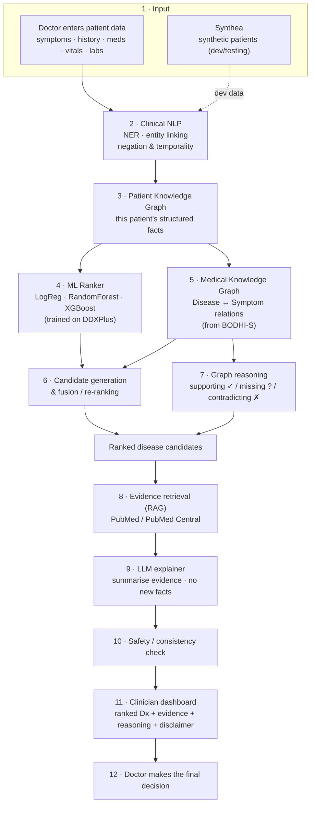
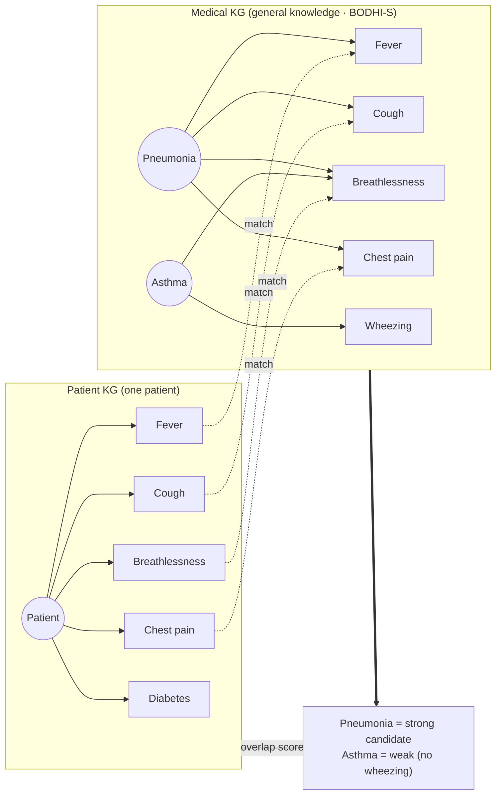
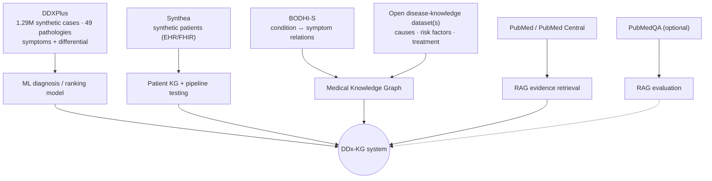

# DDx-KG — Evidence-Grounded Differential Diagnosis Assistant

> A clinician-facing decision-support prototype. It takes a patient's **symptoms and history**,
> builds a **patient knowledge graph**, matches it against a **medical knowledge graph**, uses
> **machine learning** to rank likely conditions, retrieves **real medical evidence (RAG)**, and
> asks an **LLM only to explain** the result — with sources and reasoning the doctor can inspect.

> ⚠️ **Not a medical device. Not for clinical use.** Academic research prototype only. It provides
> *decision support* to qualified medical staff — it does **not** diagnose patients, and the
> clinician is always the final decision-maker. Built and evaluated on **synthetic / open** data;
> never use it with real, identifiable patient records.

---

## Table of Contents
- [What this project is](#what-this-project-is)
- [System architecture](#system-architecture)
- [How it works, end to end](#how-it-works-end-to-end)
- [The two knowledge graphs](#the-two-knowledge-graphs)
- [Which dataset feeds which component](#which-dataset-feeds-which-component)
- [Datasets & knowledge sources (all open, no credentialing)](#datasets--knowledge-sources-all-open-no-credentialing)
- [Technology stack](#technology-stack)
- [Repository structure](#repository-structure)
- [Development order](#development-order)
- [Evaluation plan](#evaluation-plan)
- [Roadmap: phased build](#roadmap-phased-build)
- [Team (4 people)](#team-4-people)
- [Getting started](#getting-started)
- [Safety & scope](#safety--scope)
- [Licensing (read before you publish)](#licensing-read-before-you-publish)
- [References](#references)

---

## What this project is

Pure ML classifiers and LLM chatbots can be confidently wrong and give no traceable reason for
their output — unacceptable in medicine. This project combines four ideas so the system can both
**rank likely diagnoses** *and* **show its working**:

1. **Knowledge graphs** encode *structured* medical facts (which symptoms belong to which disease) so
   the system can reason over relationships, not just correlations.
2. **Machine learning** learns diagnostic patterns from data and produces a ranked differential.
3. **Retrieval-augmented generation (RAG)** grounds every explanation in *real* medical literature
   instead of letting the model invent facts.
4. **The LLM is constrained to the explanation/interface layer** — it summarises retrieved evidence;
   it is not trusted as a source of medical knowledge.

**Core research question:** *Does combining a patient KG + medical KG + ML ranking + evidence-grounded
RAG improve the accuracy, factuality, explainability, and safety of differential-diagnosis assistance
compared with ML-only, LLM-only, or plain text-RAG approaches?*

The answer comes from **ablations** (see [Evaluation](#evaluation-plan)) — that comparison, not any
single component, is the research contribution.

---

## System architecture



**Design principle:** the ML + KG core is the workhorse and ships first; **RAG and the LLM come last**
and are additive — the system produces a useful ranked, explained differential even without them.

---

## How it works, end to end

A worked example, in plain terms.

A patient presents with *"fever, cough, chest pain, difficulty breathing,"* age 45, history of
diabetes, temp 39 °C, high WBC.

| Step | What happens | Component |
|---|---|---|
| 1 | Doctor enters the case (checkboxes + free text) | UI |
| 2 | Text is parsed: `fever → PRESENT`, `chest pain → PRESENT`, *"no leg swelling" → ABSENT* | Clinical NLP |
| 3 | Facts are linked into a **patient graph** (symptoms, history, meds, labs as nodes) | Patient KG |
| 4 | ML ranks conditions from the symptom profile → `pneumonia 0.78, influenza 0.43, COVID 0.35 …` | ML ranker |
| 5 | The **medical KG** checks how well the patient's symptoms connect to each disease | Medical KG |
| 6 | ML score + KG connectivity are fused into a final ranked differential | Fusion |
| 7 | For each candidate: which symptoms **support** ✓, which expected ones are **missing** ?, which **contradict** ✗ | Graph reasoning |
| 8 | For the top candidates, retrieve supporting passages from PubMed/PMC | RAG |
| 9 | The LLM writes a readable explanation **from the retrieved evidence only** | LLM |
| 10 | A safety layer checks for contradictions, red-flags, and unsupported claims | Safety |
| 11 | The dashboard shows the ranked differential, evidence, reasoning paths, and a disclaimer | UI |
| 12 | **The doctor decides.** | Human |

The system never says *"the patient has pneumonia."* It says *"pneumonia is the strongest candidate,
here is why, here is the evidence, here is what's missing — you decide."*

---

## The two knowledge graphs

The project deliberately uses **two** graphs and connects them. This is the heart of the idea.



- **Patient KG** = *what is true about this patient* (built per case, discarded/access-controlled after).
- **Medical KG** = *what is true about medicine in general* (built once from BODHI-S + open sources).
- Overlap between the two, scored alongside the ML model, is what produces an **explainable** ranking:
  the reasoning path *is* the set of matched edges between the graphs.

---

## Which dataset feeds which component



---

## Datasets & knowledge sources (all open, no credentialing)

Chosen so the team can start on **day one** — no PhysioNet/MIMIC credentialing, no CITI training, no
Data Use Agreement, and no real patient data. **All repo IDs and licenses below were checked on
Hugging Face on 2026-09-17; re-verify before you rely on them, as mirrors and licenses change.**

| # | Resource | Repo / source | What it provides | License | Role |
|---|---|---|---|---|---|
| 1 | **DDXPlus** ⭐ | `aai530-group6/ddxplus` (HF) | 1.29M synthetic patients, 49 pathologies, evidences (symptoms/antecedents) **+ ground-truth differential** | CC-BY (synthetic) | **Primary** ML training & differential-diagnosis evaluation |
| 2 | **Synthea** | `synthetichealth/synthea` (generator) | Generates synthetic patient EHRs (conditions, meds, labs, observations) in CSV/FHIR | Free of privacy/cost restrictions | **Patient KG** + realistic pipeline/UI test data |
| 3 | **BODHI-S** | `ekacare/BODHI-S` (HF) | 10K–100K condition↔symptom relations as clinical text triples with qualifiers (severity/onset/location); India/SNOMED-tagged | **CC-BY-NC-4.0 (non-commercial)** | **Medical KG** seed — parse triples into `Disease —HAS_SYMPTOM→ Symptom` edges |
| 4 | Disease-knowledge dataset(s) | e.g. Kaggle *Disease-Symptom* / *Disease Symptoms & Treatment* | Disease → symptoms, causes, risk factors, diagnosis, treatment | Open (verify each) | **Enrich** the Medical KG; explanation text |
| 5 | **PubMed / PubMed Central** | NCBI E-utilities / PMC OA | Biomedical abstracts & open-access full text | Open (respect NCBI terms & rate limits) | **RAG** evidence corpus |
| 6 | PubMedQA *(optional)* | `pubmed_qa` (HF) | Biomedical QA over PubMed abstracts | Open | **RAG evaluation** only |

**Cautions (verify before building around these):**
- **BODHI-S is non-commercial (CC-BY-NC-4.0)** — fine for an academic project, but you must attribute
  Eka Care and keep the project non-commercial. See [Licensing](#licensing-read-before-you-publish).
- Its data is **natural-language triples**, not a ready-made Neo4j dump — you write a parser to turn
  each sentence into a KG edge (the clinical qualifiers are a bonus, not a burden).
- Large "hundreds-of-classes" symptom→diagnosis datasets (e.g. a 773-class one) are **noisy** with long
  tails; keep **DDXPlus (49 well-structured pathologies)** as the backbone, not those.

**Alternative / additional open medical KGs** (no license gate): **Hetionet** (CC0, has
Disease–presents–Symptom edges), **PrimeKG** (Harvard), **HPO** (disease↔phenotype). **UMLS / SNOMED CT**
are free but need registration — treat as a later upgrade, not a day-one dependency.

---

## Technology stack

| Layer | Choice | Notes |
|---|---|---|
| Language | **Python 3.10+** | |
| Clinical NLP | **scispaCy**, **medspaCy**, HF biomedical models (BioBERT/PubMedBERT/SapBERT) | NER, entity linking, negation, temporality |
| ML ranking | **scikit-learn**, **XGBoost** | tabular symptom → disease; the baseline & workhorse |
| KG store | **Neo4j** (or **NetworkX** to start) | patient + medical graphs, Cypher traversal |
| KG embeddings *(stretch)* | **PyKEEN** (TransE/RotatE), optional **R-GCN/GNN** (PyTorch Geometric) | research extension |
| Retrieval / RAG | **FAISS** or **Chroma** + **sentence-transformers**; **BM25** for hybrid | over PubMed/PMC chunks |
| LLM | Open local model (e.g. Llama/Mistral class) **or** an API | explanation/interface only, guardrailed |
| Backend | **FastAPI** | inference API |
| Frontend | **Streamlit** (fast) or **React** | clinician dashboard |
| Explainability | **SHAP** (ML), KG reasoning paths, citations | |
| Reproducibility | **MLflow**, **DVC**, **Docker**, fixed seeds | experiment & data versioning |

> Start the KG in **NetworkX** if Neo4j setup blocks anyone; migrate later. Start RAG with **FAISS +
> a small embedding model**; you do not need LangChain/LlamaIndex to begin.

---

## Repository structure

```
ddx-kg/
├── data/                 # datasets (DVC-tracked, NOT committed)
├── docs/                 # research prompt, design notes, this project's spec
├── notebooks/            # EDA and experiments
├── src/
│   ├── nlp/              # clinical NER, entity linking, negation, temporality
│   ├── patient_kg/       # build the per-patient graph
│   ├── medical_kg/       # parse BODHI-S + sources → Neo4j; traversal & scoring
│   ├── ml/               # rankers, calibration, SHAP
│   ├── fusion/           # ML + KG candidate generation & re-ranking
│   ├── reasoning/        # supporting / missing / contradicting analysis
│   ├── rag/              # PubMed/PMC retrieval, embeddings, reranking
│   ├── llm/              # evidence-grounded explanation + guardrails
│   ├── eval/             # metrics, ablations
│   └── api/              # FastAPI service
├── app/                  # clinician dashboard (Streamlit/React)
├── configs/              # experiment configs
├── tests/
├── requirements.txt
└── README.md
```

---

## Development order

Build the spine first; add the smart layers on top. **Do not start with the LLM.**

```mermaid
flowchart LR
    S1["1 · Get & clean<br/>open datasets"] --> S2["2 · Build DB +<br/>Patient KG (Synthea)"]
    S2 --> S3["3 · Build Medical KG<br/>(BODHI-S → Neo4j)"]
    S3 --> S4["4 · Train ML ranker<br/>(DDXPlus)"]
    S4 --> S5["5 · Fusion +<br/>graph reasoning"]
    S5 --> S6["6 · Evaluate +<br/>ablations"]
    S6 --> S7["7 · Add RAG<br/>(PubMed/PMC)"]
    S7 --> S8["8 · Add LLM<br/>explainer + guardrails"]
    S8 --> S9["9 · Dashboard +<br/>safety layer"]
    S9 --> S10["10 · Integrate &<br/>full-system eval"]
```



---

## Evaluation plan

**Diagnostic ranking (primary)** — Top-1 / Top-3 / Top-5 accuracy, MRR, Precision@k, Recall@k.

**Calibration** — ECE, Brier score, reliability curves. *Only call a score a "probability" if it
passes these.*

**Evidence / RAG** — Recall@k, Precision@k, nDCG; **supported vs unsupported claim rate**, citation
correctness (does the LLM's explanation actually follow from retrieved passages?).

**Explainability** — reasoning-path correctness; do supporting/missing/contradicting findings make
clinical sense (expert spot-check)?

**Safety** — dangerous false-negative rate, contradiction-detection rate, does it surface uncertainty.

**The experiments that make it research — ablations:**

| Configuration | Question it answers |
|---|---|
| ML only | baseline |
| LLM only | is the LLM alone enough? (expected: no — hallucinations) |
| Text-RAG + LLM | does retrieval alone fix it? |
| Medical KG only | is graph reasoning useful alone? |
| **Patient KG + Medical KG + ML + RAG + LLM** | **the proposed system** |

Remove one component at a time (patient KG, medical KG, RAG, contradiction detection, calibration) to
show **which parts actually help**. This is the central result of the project.

---

## Roadmap: phased build

**Phase 1 — Core (MVP, must ship)**
- [ ] Load DDXPlus; train a symptom → disease ranker
- [ ] Build the Medical KG from BODHI-S (parse triples → Neo4j)
- [ ] Build the Patient KG (from Synthea + entered cases)
- [ ] Fusion + reasoning: ranked differential with supporting ✓ / missing ? symptoms
- [ ] Evaluation harness + the ML-only / KG-only / fusion ablation
- [ ] Minimal clinician dashboard with disclaimer

**Phase 2 — Evidence & explanation**
- [ ] RAG over PubMed/PMC; retrieval metrics
- [ ] LLM explainer constrained to retrieved evidence + guardrails
- [ ] Contradiction & red-flag detection; safety layer
- [ ] Calibration layer + reliability diagrams

**Phase 3 — Stretch (value ÷ effort)**
- [ ] "What to ask next" — KG-driven missing-symptom suggestion
- [ ] Free-text intake via clinical NLP (negation/temporality)
- [ ] KG embeddings (TransE/RotatE) or a GNN ranker as the ML-research angle
- [ ] FHIR ingest via Synthea

**Explicitly out of scope:** autonomous diagnosis, treatment prescription, real/identifiable patient
data, hospital deployment, training a medical LLM from scratch.

---

## Team (4 people)

| Person | Owns | Key deps |
|---|---|---|
| **P1 — Medical KG** | parse BODHI-S + sources → Neo4j; schema; traversal & scoring | feeds P3, P4 |
| **P2 — Clinical NLP + ML** | NER/entity-linking/negation; Patient KG extraction; DDXPlus ranking; calibration | needs P1 schema |
| **P3 — RAG + LLM** | PubMed/PMC retrieval; embeddings; evidence synthesis; guardrailed LLM explainer | needs candidates from P2 |
| **P4 — Backend + UI + Eval + Safety** | FastAPI; dashboard; integration; evaluation harness; safety layer | integrates all |

---

## Getting started

```bash
# 1. Clone
git clone <your-repo-url> ddx-kg && cd ddx-kg

# 2. Environment
python -m venv .venv
# Windows:  .venv\Scripts\activate    |  macOS/Linux:  source .venv/bin/activate
pip install -r requirements.txt

# 3. Pull the primary dataset (example)
python -c "from datasets import load_dataset; load_dataset('aai530-group6/ddxplus')"

# 4. (later) run the API
uvicorn src.api.main:app --reload
```

---

## Safety & scope

- **Decision support, not diagnosis** — every output carries the disclaimer; the clinician decides.
- **Surfaces uncertainty and contradictions** rather than asserting certainty.
- **Always shows evidence** (matched symptoms, KG paths, citations) so a clinician can verify.
- **LLM is guardrailed** — it explains retrieved evidence; it does not introduce medical facts.
- **Open / synthetic data only** — no real patient records, so no IRB/DUA/privacy exposure for the
  prototype. (Uploaded free-text is treated as untrusted input — watch for prompt injection.)
- Known risks tracked in evaluation: dataset bias, wrong entity normalisation, automation bias /
  over-reliance, out-of-distribution presentations, stale guidelines.

---

## Licensing (read before you publish)

- **Code:** MIT suggested.
- **BODHI-S: `CC-BY-NC-4.0` — NON-COMMERCIAL.** You may use it for this academic project, but you must
  **attribute Eka Care** and must **not** use it (or derivatives) commercially. This effectively makes
  the *dataset-bearing* parts of the project non-commercial; keep that in mind before any deployment.
- **DDXPlus:** CC-BY — attribute the authors.
- **Synthea:** generated data is free of cost/privacy/security restrictions.
- **PubMed/PMC:** respect NCBI E-utilities terms and rate limits; only the PMC Open Access subset is
  freely redistributable.
- Retain each source's license and cite it; do not redistribute data you're not permitted to.

---

## References

- **DDXPlus** — Tchango et al., *DDXPlus: A New Dataset for Automatic Medical Diagnosis* (NeurIPS 2022).
- **BODHI-S** — Eka Care, condition–symptom knowledge graph (`ekacare/BODHI-S`, Hugging Face).
- **Synthea** — Walonoski et al., *Synthea: synthetic patient generator* (MITRE).
- **Hetionet** — Himmelstein et al., integrative biomedical knowledge network.
- **PrimeKG** — Chandak et al., precision-medicine knowledge graph.
- **PubMedQA** — Jin et al., biomedical QA dataset.
- **PyKEEN** — knowledge-graph embeddings; **scispaCy / medspaCy** — clinical NLP.

*Verify current URLs, versions, and licenses when you cite these.*
