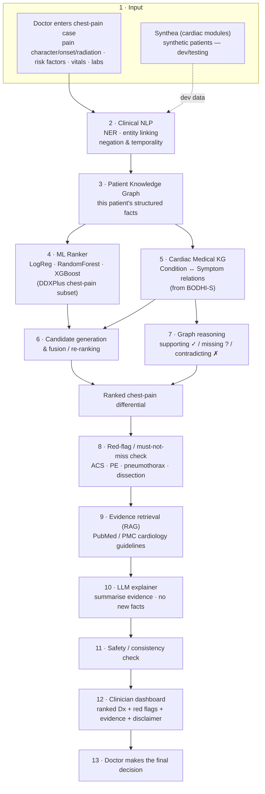
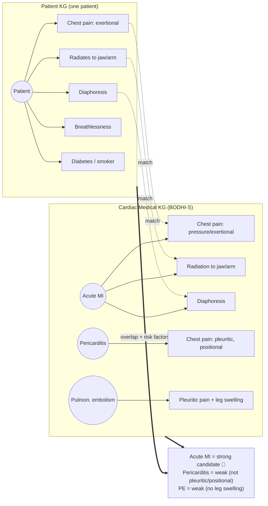
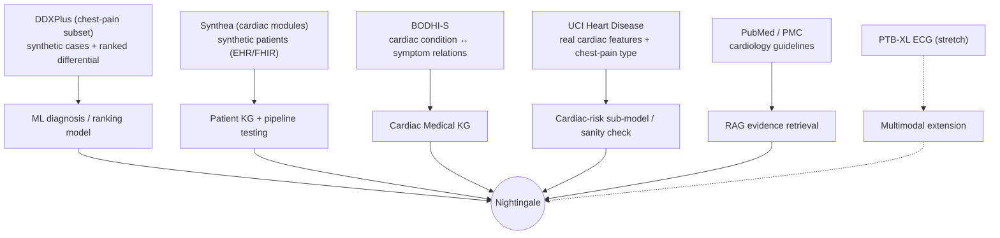

# Nightingale — Clinical Intelligence & Reasoning System

> A clinician-facing decision-support prototype for **acute chest pain**. Nightingale takes a
> patient's symptoms and history, builds a **patient knowledge graph**, matches it against a
> **cardiac medical knowledge graph**, uses **machine learning** to rank the likely causes,
> retrieves **real medical evidence (RAG)**, and asks an **LLM only to explain** the result —
> with the reasoning, the sources, and the *must-not-miss* red flags a doctor can inspect.

> ⚠️ **Not a medical device. Not for clinical use.** Academic research prototype only. It provides
> *decision support* to qualified medical staff — it does **not** diagnose patients, and the
> clinician is always the final decision-maker. Built and evaluated on **synthetic / open** data;
> never use it with real, identifiable patient records.

---

## Table of Contents
- [Scope: acute chest pain](#scope-acute-chest-pain)
- [The differential (verified against DDXPlus)](#the-differential-verified-against-ddxplus)
- [System architecture](#system-architecture)
- [How it works, end to end](#how-it-works-end-to-end)
- [The two knowledge graphs](#the-two-knowledge-graphs)
- [Which dataset feeds which component](#which-dataset-feeds-which-component)
- [Datasets & knowledge sources (all open, no credentialing)](#datasets--knowledge-sources-all-open-no-credentialing)
- [Technology stack](#technology-stack)
- [Repository structure](#repository-structure)
- [Development order](#development-order)
- [Evaluation plan](#evaluation-plan)
- [Roadmap: phased build](#roadmap-phased-build)
- [Team (4 people)](#team-4-people)
- [Getting started](#getting-started)
- [Safety & scope](#safety--scope)
- [Licensing (read before you publish)](#licensing-read-before-you-publish)
- [References](#references)

---

## Scope: acute chest pain

Nightingale is deliberately **narrow and deep**. It focuses on one of medicine's canonical and
highest-stakes differential-diagnosis problems: **a patient presenting with acute chest pain**
(± breathlessness or palpitations). It ranks the **cardiac causes** alongside the dangerous
**non-cardiac mimics** that must never be missed.

Why this scope:
- **Chest-pain triage is *the* textbook differential** — and getting it wrong (a missed MI, PE, or
  dissection) is catastrophic. That gives Nightingale a real **safety / red-flag** contribution,
  not just a ranking metric.
- **The data actually exists and is open** (see below) — DDXPlus carries a ground-truth differential
  for exactly these conditions, and BODHI-S carries the cardiac symptom vocabulary.
- **It's tractable for a 4-person, ~24-week team** — a bounded set of ~12 conditions instead of the
  whole of medicine.

**Core research question:** *Does combining a patient KG + cardiac medical KG + ML ranking +
evidence-grounded RAG improve the accuracy, factuality, explainability, and — above all — the
safety (must-not-miss recall) of chest-pain differential assistance, compared with ML-only,
LLM-only, or plain text-RAG approaches?*

---

## The differential (verified against DDXPlus)

All conditions below were confirmed present in DDXPlus (data + the source paper, arXiv:2205.09148).

| Condition | Category | Must-not-miss | In DDXPlus |
|---|---|:---:|:---:|
| Possible NSTEMI / STEMI (acute MI) | Cardiac – ischaemic | 🔴 | ✅ |
| Unstable angina | Cardiac – ischaemic | 🔴 | ✅ |
| Stable angina | Cardiac – ischaemic | | ✅ |
| Pericarditis | Cardiac – inflammatory | | ✅ |
| Myocarditis | Cardiac – inflammatory | 🔴 | ✅ |
| Acute pulmonary edema | Cardiac – failure | 🔴 | ✅ |
| Atrial fibrillation | Cardiac – arrhythmia | | ✅ |
| PSVT (paroxysmal SVT) | Cardiac – arrhythmia | | ✅ |
| Pulmonary embolism | Non-cardiac mimic | 🔴 | ✅ |
| Spontaneous pneumothorax | Non-cardiac mimic | 🔴 | ✅ |
| Boerhaave (oesophageal rupture) | Non-cardiac mimic | 🔴 | ✅ |
| GERD | Non-cardiac mimic | | ✅ |
| Panic attack | Non-cardiac mimic | | ✅ |

**Known gap — aortic dissection.** The classic must-not-miss chest-pain diagnosis is **not** in
DDXPlus. Nightingale adds it to the *medical KG* as a red-flag rule (tearing pain, radiation to
back, BP differential between arms) even though the ML model cannot be trained on it — a concrete
demonstration of *the KG catching what the ML cannot*.

---

## System architecture



**Design principle:** the ML + KG core is the workhorse and ships first; **RAG and the LLM come last**
and are additive — Nightingale produces a useful ranked, explained, red-flagged differential even
without them.

---

## How it works, end to end

A worked example.

> **58-year-old male.** 45 minutes of central chest pressure radiating to the left arm and jaw,
> sweating, breathless. Came on during exertion. History: hypertension, type-2 diabetes, smoker.
> Vitals: HR 98, BP 150/95. No leg swelling, no recent long-haul travel.

| Step | What happens | Component |
|---|---|---|
| 1 | Doctor enters the case (checkboxes + free text) | UI |
| 2 | Text is parsed: `chest pain → PRESENT (pressure, exertional, radiates to jaw/arm)`, *"no leg swelling" → ABSENT* | Clinical NLP |
| 3 | Facts are linked into a **patient graph** (symptoms, risk factors, vitals as nodes) | Patient KG |
| 4 | ML ranks the chest-pain conditions → `Possible NSTEMI/STEMI 0.55, Unstable angina 0.20, Pericarditis 0.08 …` | ML ranker |
| 5 | The **cardiac KG** checks how the patient's features connect to each condition | Cardiac KG |
| 6 | ML score + KG connectivity are fused into a ranked differential | Fusion |
| 7 | Per candidate: **supporting** ✓ (exertional, radiation, diaphoresis, risk factors), **missing** ? (troponin, ECG), **contradicting** ✗ | Graph reasoning |
| 8 | **Red-flag check** fires: ACS pattern present → escalate | Safety |
| 9 | Retrieve supporting passages (e.g. ACS guideline) from PubMed/PMC | RAG |
| 10 | The LLM writes the explanation **from retrieved evidence only** | LLM |
| 11 | Consistency check for contradictions / unsupported claims | Safety |
| 12 | Dashboard shows the ranked differential, red flags, evidence, reasoning paths, disclaimer | UI |
| 13 | **The doctor decides.** | Human |

Nightingale never says *"the patient has an MI."* It says *"acute coronary syndrome is the strongest
candidate and a red flag — here's why, here's the evidence, and you need a troponin and ECG to
confirm. You decide."*

---

## The two knowledge graphs

Nightingale uses **two** graphs and connects them — this is the heart of the idea.



- **Patient KG** = *what is true about this patient* (built per case, access-controlled/discarded after).
- **Cardiac Medical KG** = *cardiac knowledge in general* (built once from BODHI-S + open sources).
- Overlap between the two, scored alongside the ML model, produces an **explainable** ranking: the
  reasoning path *is* the set of matched edges between the graphs.

---

## Which dataset feeds which component



---

## Datasets & knowledge sources (all open, no credentialing)

Chosen so the team can start on **day one** — no PhysioNet/MIMIC credentialing, no CITI training, no
Data Use Agreement, no real patient data. **Repo IDs and licenses verified on Hugging Face
2026-09-17; re-verify before relying on them.**

| # | Resource | Repo / source | What it provides | License | Role |
|---|---|---|---|---|---|
| 1 | **DDXPlus** ⭐ | `aai530-group6/ddxplus` (HF) | 1.03M train / 135k test / 132k val synthetic cases, 49 pathologies, evidences **+ a ranked `DIFFERENTIAL_DIAGNOSIS` column**. Filter to the ~13 chest-pain conditions. | CC-BY-4.0 | **Primary** ML training & differential evaluation |
| 2 | **BODHI-S** | `ekacare/BODHI-S` (HF) | Condition↔symptom relations as clinical text triples with qualifiers (severity/onset/location/radiation); India/SNOMED-tagged. Confirmed to include Acute MI with rich chest-pain detail. | **CC-BY-NC-4.0 (non-commercial)** | **Cardiac Medical KG** seed — parse triples into `Condition —HAS_SYMPTOM→ Symptom` edges |
| 3 | **UCI Heart Disease** | `MLLab-TS/heart_disease_uci` (HF, full 4-site, 920 rows) | Real de-identified cardiac features incl. **chest-pain type**, resting BP, cholesterol, max HR, exercise-induced angina, ST depression | Open (verify) | **Cardiac-risk sub-model** / real-data sanity check — *not a differential* |
| 4 | **Synthea** | `synthetichealth/synthea` (generator) | Generates synthetic patient EHRs incl. cardiac modules (CAD, MI) in CSV/FHIR | Free of restrictions | **Patient KG** + realistic pipeline/UI test data |
| 5 | **PubMed / PMC** | NCBI E-utilities / PMC OA | Cardiology abstracts & open-access full text (guidelines) | Open (respect NCBI terms) | **RAG** evidence corpus |
| 6 | **PTB-XL** *(stretch)* | PhysioNet `ptb-xl` | 21.8k 12-lead ECGs, multi-label diagnostic incl. MI | CC-BY (verify open access) | **Multimodal** extension (ECG) |

**Cautions:**
- **DDXPlus does the differential; UCI does *not*.** UCI Heart Disease is a binary "coronary disease
  present?" classifier — a useful real-data cardiac-risk feature, but it can't rank MI vs pericarditis
  vs PE. Keep the two roles distinct.
- **DDXPlus symptoms are coded** (`E_54_@_V_161` = a pain-location value). You need its
  evidence-mapping file to decode them and align with BODHI-S's vocabulary — the **first week-1 spike**.
- **BODHI-S is non-commercial (CC-BY-NC-4.0)** — fine for academia; attribute Eka Care; no commercial
  use. Its data is NL triples, not a ready Neo4j dump — you write a parser.

**Alternative open medical KGs** (no license gate): **Hetionet** (CC0), **PrimeKG**, **HPO**.
**UMLS / SNOMED CT** are free but need registration — a later upgrade, not a day-one dependency.

---

## Technology stack

| Layer | Choice | Notes |
|---|---|---|
| Language | **Python 3.10+** | |
| Clinical NLP | **scispaCy**, **medspaCy**, HF biomedical models (BioBERT/PubMedBERT/SapBERT) | NER, entity linking, negation, temporality |
| ML ranking | **scikit-learn**, **XGBoost** | chest-pain symptom → condition; the baseline & workhorse |
| KG store | **Neo4j** (or **NetworkX** to start) | patient + cardiac graphs, Cypher traversal |
| KG embeddings *(stretch)* | **PyKEEN** (TransE/RotatE), optional **R-GCN/GNN** | research extension |
| Retrieval / RAG | **FAISS** or **Chroma** + **sentence-transformers**; **BM25** for hybrid | over PubMed/PMC chunks |
| LLM | Open local model (Llama/Mistral class) **or** an API | explanation/interface only, guardrailed |
| Backend | **FastAPI** | inference API |
| Frontend | **Streamlit** (fast) or **React** | clinician dashboard |
| Explainability | **SHAP** (ML), KG reasoning paths, citations | |
| Reproducibility | **MLflow**, **DVC**, **Docker**, fixed seeds | experiment & data versioning |

---

## Repository structure

```
nightingale/
├── data/                 # datasets (DVC-tracked, NOT committed)
├── docs/                 # research prompt, design notes, spec
├── notebooks/            # EDA and experiments
├── src/
│   ├── nlp/              # clinical NER, entity linking, negation, temporality
│   ├── patient_kg/       # build the per-patient graph
│   ├── medical_kg/       # parse BODHI-S → Neo4j; cardiac schema; traversal & scoring
│   ├── ml/               # rankers, calibration, SHAP
│   ├── fusion/           # ML + KG candidate generation & re-ranking
│   ├── reasoning/        # supporting / missing / contradicting + red-flag rules
│   ├── rag/              # PubMed/PMC retrieval, embeddings, reranking
│   ├── llm/              # evidence-grounded explanation + guardrails
│   ├── eval/             # metrics, ablations
│   └── api/              # FastAPI service
├── app/                  # clinician dashboard (Streamlit/React)
├── configs/              # experiment configs
├── tests/
├── requirements.txt
└── README.md
```

---

## Development order

Build the spine first; add the smart layers on top. **Do not start with the LLM.**

```mermaid
flowchart LR
    S1["1 · Decode & filter<br/>DDXPlus (chest pain)"] --> S2["2 · Build DB +<br/>Patient KG (Synthea)"]
    S2 --> S3["3 · Build Cardiac KG<br/>(BODHI-S → Neo4j)"]
    S3 --> S4["4 · Train ML ranker<br/>(DDXPlus subset)"]
    S4 --> S5["5 · Fusion +<br/>graph reasoning"]
    S5 --> S6["6 · Red-flag rules +<br/>evaluate / ablations"]
    S6 --> S7["7 · Add RAG<br/>(PubMed/PMC)"]
    S7 --> S8["8 · Add LLM<br/>explainer + guardrails"]
    S8 --> S9["9 · Dashboard +<br/>safety layer"]
    S9 --> S10["10 · Integrate &<br/>full-system eval"]
```



---

## Evaluation plan

**Diagnostic ranking (primary)** — Top-1 / Top-3 / Top-5 accuracy, MRR, Precision@k, Recall@k,
measured against the DDXPlus `DIFFERENTIAL_DIAGNOSIS` ground truth.

**Safety (this project's headline metric)** — **must-not-miss recall**: does the true diagnosis for
ACS / PE / pneumothorax / Boerhaave appear in the top-k? **Dangerous false-negative rate** (a
red-flag condition ranked low). Red-flag firing accuracy.

**Calibration** — ECE, Brier score, reliability curves. *Only call a score a "probability" if it
passes these.*

**Evidence / RAG** — Recall@k, Precision@k, nDCG; **supported vs unsupported claim rate**, citation
correctness (does the explanation follow from retrieved passages?).

**Explainability** — reasoning-path correctness; do supporting/missing/contradicting findings make
clinical sense (expert spot-check)?

**The experiments that make it research — ablations:**

| Configuration | Question it answers |
|---|---|
| ML only | baseline |
| LLM only | is the LLM alone enough? (expected: no) |
| Text-RAG + LLM | does retrieval alone fix it? |
| Cardiac KG only | is graph reasoning useful alone? |
| **Patient KG + Cardiac KG + ML + RAG + LLM** | **Nightingale (proposed)** |

Remove one component at a time (patient KG, cardiac KG, RAG, red-flag rules, calibration) to show
**which parts actually help** — especially on the must-not-miss safety metric. This is the central
result.

---

## Roadmap: phased build

**Phase 1 — Core (MVP, must ship)**
- [ ] Decode DDXPlus evidences; filter to the ~13 chest-pain conditions; train a ranker
- [ ] Build the Cardiac KG from BODHI-S (parse triples → Neo4j)
- [ ] Build the Patient KG (from Synthea + entered cases)
- [ ] Fusion + reasoning: ranked differential with supporting ✓ / missing ? symptoms
- [ ] Red-flag rules (ACS / PE / pneumothorax / dissection)
- [ ] Evaluation harness + the ML-only / KG-only / fusion ablation (incl. must-not-miss recall)
- [ ] Minimal clinician dashboard with disclaimer

**Phase 2 — Evidence & explanation**
- [ ] RAG over PubMed/PMC cardiology guidelines; retrieval metrics
- [ ] LLM explainer constrained to retrieved evidence + guardrails
- [ ] Contradiction detection; safety layer; calibration + reliability diagrams

**Phase 3 — Stretch (value ÷ effort)**
- [ ] "What to ask next" — KG-driven missing-test suggestion (troponin / ECG / D-dimer)
- [ ] Free-text intake via clinical NLP (negation/temporality)
- [ ] UCI Heart cardiac-risk sub-model fused into ranking
- [ ] KG embeddings (TransE/RotatE) or a GNN ranker as the ML-research angle
- [ ] PTB-XL ECG multimodal extension

**Explicitly out of scope:** autonomous diagnosis, treatment prescription, real/identifiable patient
data, hospital deployment, training a medical LLM from scratch, non-chest-pain presentations.

---

## Team (4 people)

| Person | Owns | Key deps |
|---|---|---|
| **P1 — Cardiac Medical KG** | parse BODHI-S → Neo4j; cardiac schema; traversal, scoring, red-flag rules | feeds P3, P4 |
| **P2 — Clinical NLP + ML** | NER/entity-linking/negation; Patient KG extraction; DDXPlus decoding & ranking; calibration | needs P1 schema |
| **P3 — RAG + LLM** | PubMed/PMC retrieval; embeddings; evidence synthesis; guardrailed LLM explainer | needs candidates from P2 |
| **P4 — Backend + UI + Eval + Safety** | FastAPI; dashboard; integration; evaluation harness (incl. must-not-miss); safety layer | integrates all |

---

## Getting started

```bash
# 1. Clone
git clone https://github.com/HarshRohila02/nightingale.git && cd nightingale

# 2. Environment
python -m venv .venv
# Windows:  .venv\Scripts\activate    |  macOS/Linux:  source .venv/bin/activate
pip install -r requirements.txt

# 3. Pull the primary dataset (example)
python -c "from datasets import load_dataset; load_dataset('aai530-group6/ddxplus')"

# 4. (later) run the API
uvicorn src.api.main:app --reload
```

---

## Safety & scope

- **Decision support, not diagnosis** — every output carries the disclaimer; the clinician decides.
- **Must-not-miss first** — Nightingale is judged on whether it surfaces ACS, PE, pneumothorax, and
  dissection, not just top-1 accuracy. It errs toward flagging danger.
- **Surfaces uncertainty and contradictions** rather than asserting certainty.
- **Always shows evidence** (matched symptoms, KG paths, citations) so a clinician can verify.
- **LLM is guardrailed** — it explains retrieved evidence; it does not introduce medical facts.
- **Open / synthetic data only** — no real patient records, so no IRB/DUA/privacy exposure. (Uploaded
  free text is untrusted input — watch for prompt injection.)
- Known risks tracked in evaluation: dataset bias, wrong entity normalisation, automation bias,
  out-of-distribution presentations, stale guidelines, the aortic-dissection training gap.

---

## Licensing (read before you publish)

- **Code:** MIT suggested.
- **BODHI-S: `CC-BY-NC-4.0` — NON-COMMERCIAL.** Academic use is fine, but you must **attribute Eka
  Care** and must **not** use it (or derivatives) commercially.
- **DDXPlus:** CC-BY-4.0 — attribute the authors (Tchango et al.).
- **UCI Heart Disease:** open (CC-BY 4.0 on UCI ML Repository) — verify the specific mirror.
- **Synthea:** generated data is free of cost/privacy/security restrictions.
- **PubMed/PMC:** respect NCBI E-utilities terms and rate limits; only the PMC Open Access subset is
  freely redistributable.
- **PTB-XL:** CC-BY — verify before redistributing.

---

## References

- **DDXPlus** — Tchango et al., *DDXPlus: A New Dataset for Automatic Medical Diagnosis* (NeurIPS 2022,
  arXiv:2205.09148).
- **BODHI-S** — Eka Care, condition–symptom knowledge graph (`ekacare/BODHI-S`, Hugging Face).
- **UCI Heart Disease** — Janosi, Steinbrunn, Pfisterer & Detrano, UCI ML Repository.
- **Synthea** — Walonoski et al., *Synthea: synthetic patient generator* (MITRE).
- **PTB-XL** — Wagner et al., *PTB-XL, a large publicly available ECG dataset* (PhysioNet).
- **Hetionet / PrimeKG** — open biomedical knowledge graphs.
- **PyKEEN** — KG embeddings; **scispaCy / medspaCy** — clinical NLP.

*Verify current URLs, versions, and licenses when you cite these.*

---

*Nightingale — named for Florence Nightingale, a founder of evidence-based clinical practice.
Decision support, not a decision-maker.*
