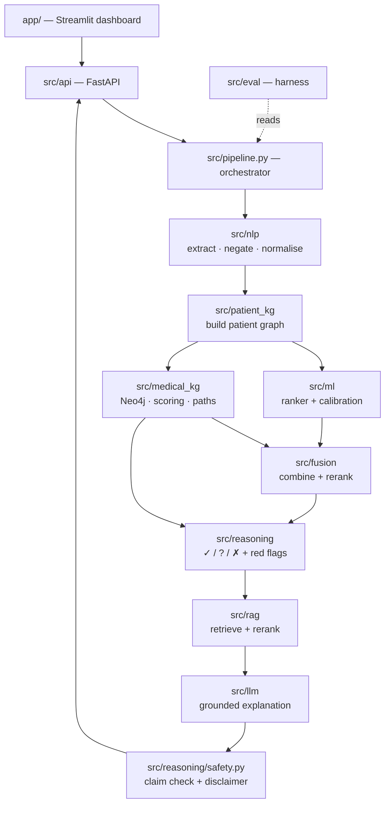
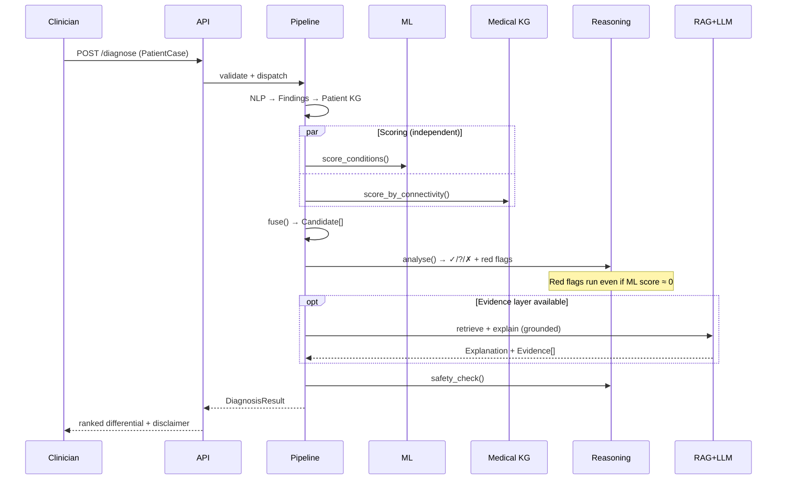
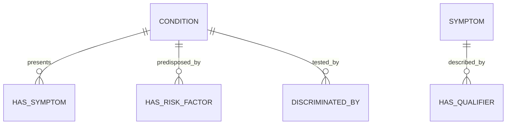

# 02 — Architecture & Interface Contracts

**Version:** 1.7 · 2026-09-19 (v1.7: open decision A-7; v1.6: the Neo4j store and the §7 fallback to NetworkX are built; v1.5: the team approved adding `ddxplus` and `crosswalk` to `Finding.source` in §4.2, and accepted A-5 and A-6 as working values; v1.4: the §5.1 KG card covers BODHI-S and §5.2 has 64 concepts; v1.3 added the hand-authored aortic dissection, the graph's sources and open decision A-6; v1.2 added the §5.2 crosswalk card and A-5)
**Owners:** P1 (knowledge graph) + P2 (data/ML)

> **This is the most important Phase 0 document.** The schemas in §4 are what let four people work
> in parallel against stubs. Changing them mid-project breaks everyone, so review them carefully
> now. After Week 1 they change only by agreement of all four.

---

## 1. Architectural principles

1. **Every module is replaceable behind an interface.** Neo4j may become NetworkX; the local LLM
   may become templated text. Nothing downstream should notice.
2. **Degrade, never crash.** If retrieval or the LLM fails, the system still returns a ranked,
   KG-explained differential (NFR-4, FR-7.4).
3. **Safety is not downstream of ML.** Red-flag rules run independently and can surface a condition
   the ranker scored near zero.
4. **Explanations are derived, not generated.** Supporting/missing/contradicting findings come from
   graph operations. The LLM only *phrases* them; it never invents them.
5. **Typed boundaries.** All inter-module data uses the models in `src/contracts.py`.

---

## 2. Component architecture



### Module responsibilities

| Module | Owner | Responsibility | Must **not** |
|---|---|---|---|
| `src/nlp` | P3 | Text → `Finding[]` with assertion status | Rank or score conditions |
| `src/patient_kg` | P3 | `Finding[]` → patient graph | Contain medical knowledge |
| `src/medical_kg` | P1 | Cardiac KG; scoring; reasoning paths | Know about a specific patient's ML score |
| `src/ml` | P2 | `PatientCase` → per-condition scores; owns the concept → token inversion and the feature encoding | Produce explanations; read YAML |
| `src/fusion` | P4 | Combine ML + KG → ranked `Candidate[]` | Re-query the graph |
| `src/reasoning` | P1/P3 | ✓/?/✗ analysis; red-flag rules; safety checks | Call the LLM |
| `src/rag` | P3 | Query → `Evidence[]` | Generate prose |
| `src/llm` | P3 | Evidence + candidates → `Explanation` | Introduce unretrieved facts |
| `src/eval` | P4 | Metrics, baselines, ablations | Modify pipeline behaviour |
| `src/api`, `app/` | P4 | Transport & presentation | Contain clinical logic |

---

## 3. Request flow



---

## 4. Interface contracts — `src/contracts.py`

Pydantic models. **Every module imports from here; no module defines its own version.**

### 4.1 Enumerations

```python
class Assertion(str, Enum):
    PRESENT = "present"
    ABSENT  = "absent"      # explicitly denied — NOT the same as unknown
    UNKNOWN = "unknown"     # not asked / not recorded

class Sex(str, Enum):
    MALE = "M"; FEMALE = "F"; OTHER = "O"

class EvidenceRole(str, Enum):
    SUPPORTING    = "supporting"
    CONTRADICTING = "contradicting"
    MISSING       = "missing"
```

### 4.2 Input

```python
class Finding(BaseModel):
    concept_id: str                  # canonical KG concept id, e.g. "SYM:chest_pain"
    label: str                       # human-readable, e.g. "Chest pain"
    assertion: Assertion = Assertion.PRESENT
    qualifiers: dict[str, str] = {}  # {"radiate": "to jaw", "onset": "sudden"}
    source: str = "structured"       # "structured" | "free_text" | "synthea" | "ddxplus" | "crosswalk"
    evidence_span: str | None = None # original text, if extracted

class PatientCase(BaseModel):
    case_id: str
    age: int = Field(ge=0, le=120)
    sex: Sex
    findings: list[Finding] = []
    risk_factors: list[Finding] = []
    vitals: dict[str, float] = {}    # {"hr": 98, "sbp": 150, "temp_c": 37.1}
    free_text: str | None = None
```

### 4.3 Output

```python
class ReasoningPath(BaseModel):
    """One KG path explaining why a finding supports a condition."""
    finding_id: str
    condition_id: str
    path: list[str]                  # ["Chest pain", "HAS_SYMPTOM", "Acute MI"]
    weight: float = 1.0

class FindingAssessment(BaseModel):
    finding_id: str
    label: str
    role: EvidenceRole
    rationale: str | None = None

class Evidence(BaseModel):
    source: str                      # "PubMed" | "PMC" | "KG"
    title: str
    passage: str
    citation: str                    # e.g. "PMID:12345678"
    url: str | None = None
    score: float = 0.0

class Candidate(BaseModel):
    condition_id: str
    label: str
    ml_score: float = 0.0            # raw model output
    kg_score: float = 0.0            # graph connectivity score
    fused_score: float = 0.0         # final ranking score
    calibrated_probability: float | None = None   # None until calibrated — do NOT display raw
    is_must_not_miss: bool = False
    red_flag: bool = False
    red_flag_reason: str | None = None
    assessments: list[FindingAssessment] = []
    paths: list[ReasoningPath] = []
    evidence: list[Evidence] = []

class Explanation(BaseModel):
    text: str
    grounded: bool                   # False if any claim lacked support
    unsupported_claims: list[str] = []
    citations: list[str] = []

class DiagnosisResult(BaseModel):
    case_id: str
    candidates: list[Candidate]      # ordered by fused_score, descending
    red_flags: list[str] = []
    suggested_next_tests: list[str] = []
    explanation: Explanation | None = None
    disclaimer: str = DISCLAIMER     # constant from contracts.py — always populated
    degraded_components: list[str] = []   # e.g. ["rag", "llm"] when unavailable
    generated_at: datetime
```

### 4.4 Module interfaces

```python
class ConditionRanker(Protocol):          # src/ml
    def score(self, case: PatientCase) -> dict[str, float]: ...

class GraphStore(Protocol):               # src/medical_kg — Neo4j or NetworkX
    def score_by_connectivity(self, case: PatientCase) -> dict[str, float]: ...
    def paths_for(self, case: PatientCase, condition_id: str) -> list[ReasoningPath]: ...
    def expected_findings(self, condition_id: str) -> list[Finding]: ...

class EvidenceRetriever(Protocol):        # src/rag
    def retrieve(self, condition: str, case: PatientCase, k: int = 5) -> list[Evidence]: ...

class Explainer(Protocol):                # src/llm
    def explain(self, case: PatientCase, candidates: list[Candidate]) -> Explanation: ...
```

**Stub-first rule:** every Protocol gets a trivial stub implementation in Week 1
(`ConstantRanker`, `EmptyRetriever`, `TemplateExplainer`). This is what makes the Week-3 walking
skeleton possible before any component is finished.

---

## 5. Medical KG schema



| Node | Key properties |
|---|---|
| `Condition` | `id`, `label`, `category` (cardiac/mimic), `is_must_not_miss`, `in_training_data` |
| `Symptom` | `id`, `label`, `body_system` |
| `RiskFactor` | `id`, `label` |
| `Test` | `id`, `label` (troponin, ECG, D-dimer, CXR) |

| Relationship | Properties |
|---|---|
| `HAS_SYMPTOM` | `weight`, `qualifier_key`, `qualifier_value`, `typical` (bool) |
| `HAS_RISK_FACTOR` | `weight` |
| `DISCRIMINATED_BY` | `discriminative_power` — drives "what to ask next" |

`in_training_data = false` marks **aortic dissection**: reachable by KG rules, invisible to ML.

### 5.1 KG card: what the cardiac graph contains · *built 2026-09-18, updated 2026-09-19*

`build_cardiac_kg()` (`src/medical_kg/cardiac_kg.py`) merges the graph's sources into one
backend-neutral `KnowledgeGraph`: DDXPlus `release_conditions.json`, read from
`data/interim/ddxplus_chestpain_conditions.json` and `ddxplus_evidences.json`
(`src/medical_kg/loader.py`), and the hand-authored aortic dissection
(`src/medical_kg/hand_authored.py`), and BODHI-S for MI, pericarditis, PE and GERD
(`src/medical_kg/bodhi_s.py`) when `data/raw/bodhi_s` is present. `NetworkXGraphStore`
(`src/medical_kg/networkx_store.py`) serves it from memory, and `Neo4jGraphStore`
(`src/medical_kg/neo4j_store.py`) from the team's AuraDB copy. Print this card with
`python scripts/build_cardiac_kg.py`.

**Ids and provenance.** Conditions keep their registry ids (`COND:*`). DDXPlus evidence questions
become `DDX:E_nn` (`concept_id()` in `src/ddxplus.py`). That keeps them apart from the hand-authored
`SYM:*` / `RF:*` ids that the red-flag rules and golden cases use; the crosswalk (§5.2) links the
two. **Every edge carries a `source`**: `ddxplus`, `hand_authored` or `bodhi_s`. A
concept that means the same as a yes/no DDXPlus question sits on that question's node
(`canonical_concept_id`, §5.2). The store is a `MultiDiGraph` keyed by source, so a fact that two
sources both state is kept twice but counted once. This lets the report separate the KG's
shared-source contribution from its independent ones (R-12, docs/05 §8.7), and
`only_sources()` keeps a subset for ablations.

| Measure | Value |
|---|---|
| Nodes | 129: 14 Condition · 66 Symptom · 49 RiskFactor. They are the 84 DDXPlus questions, 2 more that BODHI-S uses (dysphagia `E_65`, fever `E_91`), and 29 answer-level concept nodes: 18 from the hand-authored facts and 11 from BODHI-S |
| Edges | 321: **245 `ddxplus`** (160 `HAS_SYMPTOM` · 85 `HAS_RISK_FACTOR`, weight 1.0), **56 `bodhi_s`** (45 · 11) and **20 `hand_authored`** (13 · 7). The last two are weighted by likelihood. DDXPlus and BODHI-S both state 21 condition-concept pairs, and each is counted once |
| Conditions without edges | none. ~~Aortic dissection (hand-authoring pending)~~ hand-authored 2026-09-19 |
| Evidence questions unique to one condition | 49 of 84 DDXPlus questions |
| Questions shared by ≥ 75% of the conditions | 9: the seven pain questions (`E_53`–`E_59`), breathlessness (`E_66`) and travel (`E_204`, all 13) |
| Anomalies | `E_16` "Do you feel anxious?" is a symptom of PSVT and panic attack, but DDXPlus flags it as an antecedent; it is typed by its use. `E_110` (immobilisation) is a risk factor in DDXPlus, but our concept `SYM:recent_immobilisation` calls it a symptom; DDXPlus's typing is kept |

**Known limitations. Read these before using the scores.**

1. **Questions, not answers.** DDXPlus links conditions to evidence *questions*. Twelve of the
   thirteen conditions "have" `E_54`, "characterize your pain". So the graph cannot tell tearing
   pain from burning pain, or pleuritic from pressure-like. That has to come from BODHI-S
   enrichment, the crosswalk and red-flag rules, or the ML ranker. The hand-authored edges, and
   BODHI-S's, are answer-level: they point at concepts such as `SYM:pain_character_tearing`.
2. **Stable angina's evidence set sits inside unstable angina's.** All 20 of stable angina's
   questions are among unstable angina's 24. Only `E_13` (worsening with less effort), `E_14` (pain
   at rest), `E_50` (sweating) and `E_148` (nausea) separate them. Overlap is normalised by set
   size, so a patient with stable angina's full picture **plus rest pain** scores **stable 1.00,
   unstable 0.875**. The benign condition ranks above the must-not-miss one, although rest pain is
   the defining sign of unstable angina. On validate patients, the graph alone ranks unstable
   angina first for only **21%** of those who have it (EXP-015). **2a must fix this**, for
   example by weighting
   discriminating questions or by PPR. **2d must add a red-flag rule for unstable angina**, which is
   one of three must-not-miss conditions still without one (with myocarditis and acute pulmonary
   edema).
3. **Node labels are DDXPlus's machine-translated questions**, such as "Have you had significantly
   increased sweating?". There is no `body_system` yet. The crosswalk does not relabel nodes: a
   finding it derives carries its question's label, so a reasoning path names the question that
   matched (§5.2). Clinical labels for the 84 questions are still to do.
4. **Scoring is the stub's weighted overlap**, kept so that the store is a drop-in replacement. The
   real scoring is 2a (EXP-005).
5. ~~**The pipeline and golden cases still use the stub store.** They use `SYM:*` ids, which need the
   crosswalk first.~~ *Updated 2026-09-18:* a hand-authored case now runs on this graph after
   `expand_case` (§5.2). The golden cases pass on it, but **only because red flags rank first**: by
   graph score alone, GC-001's MI ranks fifth (EXP-014). CI still runs them on the stub, because
   data/ is not committed. Locally they run on both.

**Hand-authored aortic dissection** (`src/medical_kg/hand_authored.py`, 2026-09-19). DDXPlus has
no aortic dissection, so these 20 edges are the graph's first knowledge that does not come from
DDXPlus. They cover the 13 markers of the **ADD-RS**, the aortic dissection detection risk score
of the 2010 ACCF/AHA guideline (Rogers 2011 validated it on IRAD patients): the high-risk
conditions, pain features and examination findings. They also cover where the pain is, sharp
pain, syncope, hypertension and cocaine use. Each weight is P(finding | dissection) in the bands
of `LIKELIHOOD_WEIGHT` (open decision A-6), taken from the IRAD registry where it reports a
frequency (Hagan, JAMA 2000; Evangelista, Glob Cardiol Sci Pract 2016):

| Band | Findings |
|---|---|
| very high (≥ 80%) | abrupt onset 85% |
| high (50–79%) | chest pain 73%, hypertension 72%, sharp pain about 60%, back pain 53%, tearing pain about 50%, severe pain (no frequency transcribed) |
| medium (20–49%) | aortic regurgitation murmur 32%, hypotension over 25% of type A, pain radiating to the back (no separate figure) |
| low (5–19%) | known aortic aneurysm 16%, pulse deficit 15%, syncope 13%, Marfan syndrome 5%; ADD-RS markers with no published frequency (inter-arm blood-pressure difference, focal neurological deficit, aortic valve disease, family history) |
| rare (< 5%) | iatrogenic 4%, cocaine 1.8% |

Every edge records its evidence and reference. **In GC-003, aortic dissection now ranks first
on graph score alone (0.48)**; before, it scored 0 and only its red flag surfaced it.

**BODHI-S enrichment** (`src/medical_kg/bodhi_s.py`, 2026-09-19). For MI, pericarditis, PE and
GERD, BODHI-S knows the answers where DDXPlus knows only the questions: squeezing pain and
radiation to the jaw for MI, relief on leaning forward for pericarditis. Each of its 107 facts
about these conditions maps to the crosswalk concepts it implies, and each concept is at least as
broad as the fact, so the fact's likelihood is a floor for the concept's. Where several facts land
on one concept, the strongest wins. 98 facts map, giving 56 edges (MI 20, GERD 15, PE 12,
pericarditis 9). 31 sit on DDXPlus question nodes, 21 of them restating a DDXPlus fact, and 25 on
concept nodes. Their weights are P(finding | condition): 9 very high, 29 high, 13 medium, 5 low.
Seven facts cannot be mapped: belching, hiccups, indigestion, spicy food, lack of exercise, past
tuberculosis, and a vague "myocardial problem". Two have zero strength. The module holds no
BODHI-S text: facts are keyed by BODHI-S's ids (licence: docs/03 §1.2).

**The graph alone on DDXPlus patients** (EXP-015, validate, ties broken at random): **top-1
0.880, top-3 0.998.** That is circularity, not skill (R-12). DDXPlus generated these patients
from the same condition definitions the graph is built from, so the graph recognises them almost
perfectly. On the hand-written golden cases, the same graph puts GC-001's MI fifth. Adding aortic
dissection moved top-1 by 0.001. It takes a top-3 place for 3.1% of patients and first place for
none; no validate patient has it. **BODHI-S lowers top-1 to 0.856, and MI's to 0.60** (EXP-016).
The overlap score divides by all of a condition's evidence, so the four enriched conditions are
penalised for knowing more, including findings DDXPlus never records, such as hypotension. On
GC-001, BODHI-S lifts MI from fifth to third. **2a must change the score before the enriched graph
ranks anything**; until then, `only_sources()` can leave BODHI-S out of scoring and keep it for
explanations.

**Backend status (2026-09-19):** both ✅. The graph is on **AuraDB Free** (decision D-6) under
the label `CardiacKG`, written and checked by `scripts/load_neo4j.py`
([11](11-compute-runbook.md) §5). `Neo4jGraphStore` reads it once at start-up and scores it in
memory exactly as `NetworkXGraphStore` does, so a paused instance cannot stall a consultation.
A fingerprint over every node and edge shows the two copies are the same graph, and it catches
an edit made in Neo4j by hand. `open_graph_store()` falls back to NetworkX when Aura cannot be
reached (§7).

### 5.2 Crosswalk card: hand-authored concepts ↔ DDXPlus evidence · *built 2026-09-18*

`CROSSWALK` in `src/medical_kg/crosswalk.py` has one entry for each of the **64 hand-authored
concepts** the codebase uses: every `SYM:*` / `RF:*` id in the red-flag rules, the golden cases,
`STUB_SYMPTOM_MAP`, the hand-authored graph facts and the BODHI-S mapping. A test fails if one is
missing. (It had 33 on 2026-09-18. On 2026-09-19, 14 aortic-dissection markers and 17 concepts
for BODHI-S were added.) Each entry names the DDXPlus answers that express
the concept: a question (`E_nn`) and, depending on its type, the answers that count (`V_nn`), the
lowest value on a 0–10 scale, or one side versus both sides of paired body locations. Validate it
and see its effect with `python scripts/check_crosswalk.py`.

**Match types** are the SKOS mapping relations, read as "the DDXPlus answer is ___ the concept".
Each allows only the inferences that are logically sound:

| Match | Entries | Concept present ⇒ answer | Answer ⇒ concept | Concept denied ⇒ question denied |
|---|---|---|---|---|
| `exact` | 22 | ✓ | ✓ | ✓, for a yes/no question |
| `close` | 21 | ✓ | ✓ | ✓, for a yes/no question |
| `broader` | 4 | ✓ | — | — |
| `narrower` | 3 | — | ✓ | ✓, for a yes/no question |
| `related` | 5 (irregular pulse, regurgitation, family history of aortic disease, aortic manipulation, cocaine use) | — | — | — |
| `none` | 9 (inter-arm BP difference, pulse deficit, focal neurological deficit, aortic regurgitation murmur, hypotension, connective tissue disease, thoracic aortic aneurysm, frothy sputum, hyperventilation) | — | — | — |

A denial carries over only to a yes/no question: denying "radiation to the jaw or arm" says nothing
about radiation to the back, so it cannot deny `E_57`, "does the pain radiate?".

**Where a concept lives in the graph** (`canonical_concept_id`). A concept that means the same as
a yes/no DDXPlus question (an exact or close match) sits on that question's node: `SYM:diaphoresis`
is `DDX:E_50`, and `RF:hypertension` is `DDX:E_104`. A fact that DDXPlus and another source both
state is then one node with two edges, counted once. Every other concept keeps its own node, such
as an answer to a multiple-choice question (`SYM:pain_character_tearing`) or a finding DDXPlus
lacks (`SYM:pulse_deficit`). `expand_case` puts both kinds into a hand-authored case, so it meets
both.

**Two translations.**

- **`expand_case(case, labels)`, hand-authored → graph.** It adds the `DDX:E_nn` findings the case
  implies, plus the question each follow-up belongs to (`E_54`–`E_59` → `E_53`, `E_152` → `E_151`).
  The original findings stay first, so the red-flag rules see what they saw before. A derived
  finding has `source = "crosswalk"`, a qualifier `crosswalk_from` naming its concept, and **the
  label of its question, never of the finding it came from**. "Pressure-type pain" matches every
  condition linked to `E_54`, "characterize your pain", so a path must not claim GERD presents with
  pressure-type pain. A question implied both present and denied is left out, and a warning is
  logged. Pass the graph's own labels: `dict(store.graph.nodes(data="label"))`.
- **`concepts_from_evidences(tokens)` and `case_from_ddxplus(row, specs, labels)`, DDXPlus →
  concepts.** They let the red-flag rules run on DDXPlus patients. `case_from_ddxplus` reads the
  input columns only. A question a row does not list stays UNKNOWN, not ABSENT: whether DDXPlus's
  silence means "no" is for 2a to decide.

**Judgment calls to review.** Each is in its entry's note, and the French wording is quoted, because
the English is machine-translated.

- *Chest* is the upper, lower, lateral and posterior chest and the breasts, not the epigastrium.
- *Pressure-type pain* is `une lourdeur` (heaviness); DDXPlus has no pressure or tightness answer.
- *Radiation to jaw/arm* includes the chin and the shoulder, not the neck or throat.
- *Leg* runs from thigh to sole, toes excluded.
- *Severe pain* is `E_56` ≥ 7 of 10, the usual numeric-rating-scale band.
- *Sharp pain* is `vive`, `un coup de couteau` or `lancinante`.
- *Abdominal pain* covers the belly, epigastrium, hypochondria, flanks and iliac fossae; *neck
  radiation* covers the throat and the sides and back of the neck.
- ***Sudden onset* is `E_59` ≥ 8 (open decision A-5).** DDXPlus draws the onset speed uniformly
  within a range for each condition, so it is weak evidence.
- *Exertional* and *relieved by rest* are narrower than `E_218`, which asks both at once. A
  hand-authored "exertional" therefore does not imply `E_218`, although a DDXPlus `E_218` implies
  both concepts.

**What the check found (EXP-014, validate split).**

- The mapping behaves as the clinical picture predicts, wherever DDXPlus encodes it: heaviness in the
  ischaemic conditions, burning in GERD, pleuritic pain in pneumothorax, PE and pericarditis,
  unilateral leg swelling in PE.
- **The red-flag rules over-fire on DDXPlus (R-15).** 59% of patients get a flag, and the
  aortic-dissection rule alone flags 50%, because back radiation by itself fires it.
- **The golden cases pass on the real graph only because red flags rank first.** By graph score
  alone, GC-001's MI ranks fifth, behind Boerhaave, pericarditis, pneumothorax and stable angina.

**Two new `Finding.source` values**: `crosswalk` (derived) and `ddxplus` (read from a DDXPlus row).
The field is a free string, so nothing breaks. Adding them to its description in
`src/contracts.py` and §4.2 was a contracts change, which needs all four members. The team
agreed on 2026-09-19, as relayed by the owner.

---

## 6. Fusion

```
fused = w_ml · norm(ml_score) + w_kg · norm(kg_score)
```

Start with `w_ml = w_kg = 0.5`; tune on **validation only**. Report the weights in the final report —
they are a result, not a hidden hyperparameter. A learned fusion (logistic regression over both
signals plus agreement features) is a Phase 3 stretch.

**Red flags bypass fusion entirely.** A red-flagged condition is surfaced in `DiagnosisResult.red_flags`
regardless of its rank.

---

## 7. Failure and degradation matrix

| Failure | Behaviour | Surfaced as |
|---|---|---|
| Neo4j unavailable | Fall back to NetworkX in-memory graph | `degraded_components: ["graph_backend"]` |
| Retrieval fails | Skip evidence; KG-only explanation | `["rag"]` |
| LLM unavailable | Templated explanation from KG paths | `["llm"]` |
| Model not loaded, or trained on other features | KG-only ranking, flat ML scores | `["ml"]` |
| Case the feature space cannot hold (`Sex.OTHER`) | KG-only ranking | `["ml"]` |
| Empty/invalid case | HTTP 422 with field errors | — |

The UI must always render `degraded_components` — a silently degraded medical tool is a safety
problem.

*Built 2026-09-23.* `open_ranker()` (`src/ml/ranker.py`) is the same pattern for the model.
Without the release files, without a trained model, or with a model whose feature fingerprint
differs from the encoder's, it returns a `DegradedRanker` whose flat scores `fuse_scores`
normalises to zeros — so the ranking is the graph's alone, and `degraded_components` says `ml`.
`models/` and `data/` are gitignored, so a fresh clone and CI are degraded by default, which is
correct. An unknown backend name raises instead, because that is a configuration typo rather than
a fact about the machine.

A hand-authored case reaches the model through `src/ml/case_tokens.py`, which chooses the DDXPlus
*answer* each concept stands for; `expand_case` stops at the question, deliberately, because that
is the level the graph works at (§5.2). The configured backend is **logistic regression, not
XGBoost**: see EXP-017 and R-18, and `ml:` in `configs/config.yaml`.

*Built 2026-09-19.* `open_graph_store()` (`src/medical_kg/neo4j_store.py`) reads the graph from
AuraDB at start-up. When Aura is not configured, is paused, is offline or refuses the login, the
NetworkX store over the locally built graph stands in. Its results are complete, and
`graph_backend` in `degraded_components` says the configured backend is missing. If the graph
store fails outright, the ranking is ML-only, reported the same way.

---

## 8. Directory layout

```
nightingale/
├── docs/                 # this documentation set
├── src/
│   ├── contracts.py      # §4 — the single source of truth for schemas
│   ├── conditions.py     # the conditions in scope (13 trainable + aortic dissection)
│   ├── ddxplus.py        # DDXPlus token grammar, column roles, test-split gate (shared)
│   ├── pipeline.py       # orchestrator
│   ├── nlp/ patient_kg/ medical_kg/ ml/ fusion/ reasoning/ rag/ llm/ eval/ api/
├── app/                  # Streamlit dashboard
├── scripts/              # download_data.py, decode_ddxplus.py, build_ddxplus_chestpain.py,
│                         # build_cardiac_kg.py, check_crosswalk.py, load_neo4j.py,
│                         # check_gpu.py
├── configs/  notebooks/  tests/  data/   # data/ is gitignored
└── docker-compose.yml    # optional local Neo4j (the team uses AuraDB Free, D-6)
```

---

## 9. Open decisions

IDs are prefixed `A-` (architecture) to keep them apart from the `D-n` decisions in `PROGRESS.md`
§3. They were renamed on 2026-09-18 and were previously D-1 to D-4.

| # | Decision | Resolve by | Owner |
|---|---|---|---|
| A-1 | KG backbone: BODHI-S vs DDXPlus co-occurrence | ✅ **Resolved 2026-09-17:** DDXPlus `release_conditions.json`, with BODHI-S as enrichment ([10](10-spike-r01-crosswalk.md)) | P1 |
| A-2 | Fusion weights: fixed vs learned | Phase 2 | P4 |
| A-3 | Embedding model for retrieval | Phase 3 | P3 |
| A-4 | Local LLM model + quantisation | Phase 3. The model choice is `PROGRESS.md` D-5; where it runs is decided per job (D-7, [11](11-compute-runbook.md)) | P3 |
| A-5 | The cut-off for "sudden onset" on DDXPlus's 0–10 onset-speed scale (`E_59`). Set to ≥ 8 in `src/medical_kg/crosswalk.py` as a judgment call; DDXPlus draws the value uniformly within each condition's range (§5.2) | **Accepted 2026-09-19** by the team as the working value; 2d re-checks it with EXP-008 | P3 |
| A-6 | The weight of each likelihood band (`LIKELIHOOD_WEIGHT` in `src/medical_kg/loader.py`): rare 0.03, low 0.12, medium 0.35, high 0.65, very high 0.9, the middle of the bands under 5%, 5–19%, 20–49%, 50–79% and 80% or more. BODHI-S publishes no numeric bands; DDXPlus edges keep 1.0 (§5.1) | **Accepted 2026-09-19** by the team as the working weights; 2a re-checks them with EXP-005 | P1 |
| A-8 | Whether the concept → DDXPlus-token inversion (`src/ml/case_tokens.py`) may use `Match.NARROWER` entries. `expand_case` excludes them soundly: a patient with the concept need not give that answer. But a strict inversion drops `SYM:sudden_onset`, `SYM:exertional` and `SYM:relieved_by_rest` entirely, and those are the discriminators for embolism, pneumothorax, dissection and the anginas — a golden case then reaches the model with nothing to separate them. Set to admit them (`include_narrower: true`), with every token so derived recorded in `CaseTokens.narrower`. The same class of judgment as A-5. **Also for the team: a clinical review of the 17 entries in `REPRESENTATIVE` / `ORDINAL_REPRESENTATIVE`** — which single DDXPlus answer stands for each concept (R-17) | 1c, now | P2 |
| A-7 | Which true conditions make each red flag *clinically appropriate*, for red-flag precision (docs/05 §3.2: reported, not targeted). `red_flag_precision()` in `src/eval/metrics.py` counts a flag as appropriate only when it names the true condition, which undercounts: the MI flag on an unstable-angina patient is clinically reasonable (EXP-014). A mapping such as MI → {MI, unstable angina} is a clinical judgment for the team | 2d, with EXP-008 | P3 |
