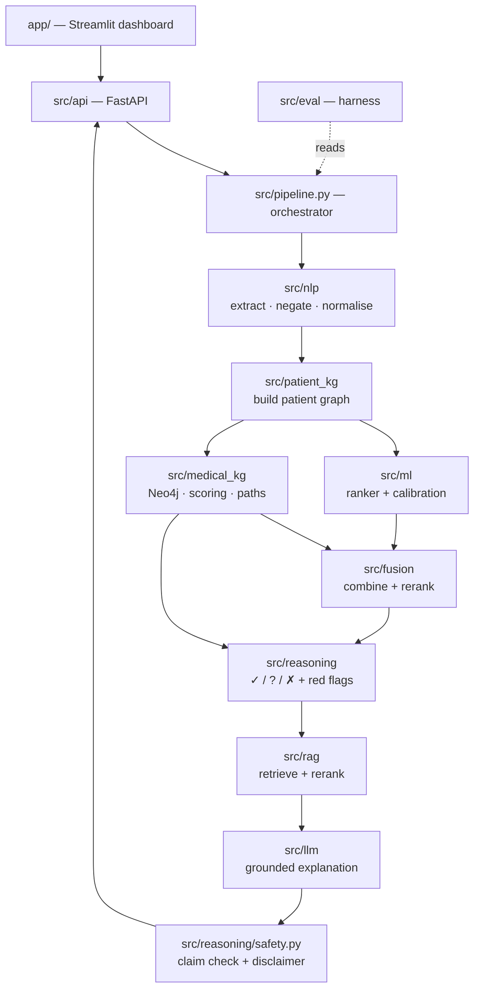
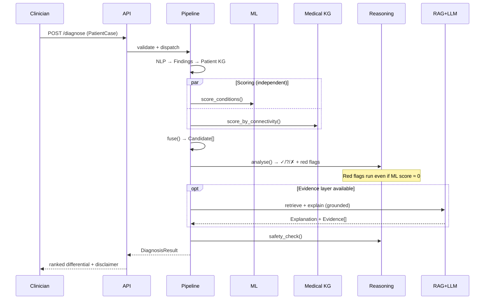
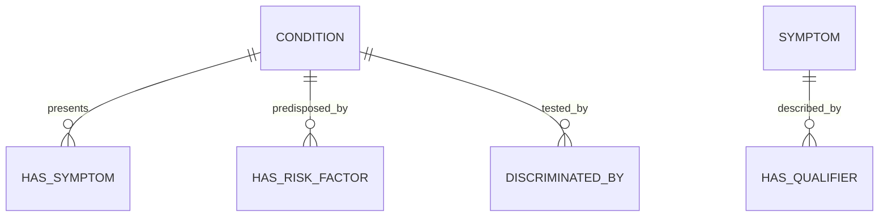

# 02 — Architecture & Interface Contracts

**Version:** 1.0 · 2026-09-17
**Owners:** P1 (knowledge graph) + P2 (data/ML)

> **This is the most important Phase 0 document.** The schemas in §4 are what let four people work
> in parallel against stubs. Changing them mid-project breaks everyone, so review them carefully
> now. After Week 1 they change only by agreement of all four.

---

## 1. Architectural principles

1. **Every module is replaceable behind an interface.** Neo4j may become NetworkX; the local LLM
   may become templated text. Nothing downstream should notice.
2. **Degrade, never crash.** If retrieval or the LLM fails, the system still returns a ranked,
   KG-explained differential (NFR-4, FR-7.4).
3. **Safety is not downstream of ML.** Red-flag rules run independently and can surface a condition
   the ranker scored near zero.
4. **Explanations are derived, not generated.** Supporting/missing/contradicting findings come from
   graph operations. The LLM only *phrases* them; it never invents them.
5. **Typed boundaries.** All inter-module data uses the models in `src/contracts.py`.

---

## 2. Component architecture



### Module responsibilities

| Module | Owner | Responsibility | Must **not** |
|---|---|---|---|
| `src/nlp` | P3 | Text → `Finding[]` with assertion status | Rank or score conditions |
| `src/patient_kg` | P3 | `Finding[]` → patient graph | Contain medical knowledge |
| `src/medical_kg` | P1 | Cardiac KG; scoring; reasoning paths | Know about a specific patient's ML score |
| `src/ml` | P2 | `PatientCase` → per-condition scores | Produce explanations |
| `src/fusion` | P4 | Combine ML + KG → ranked `Candidate[]` | Re-query the graph |
| `src/reasoning` | P1/P3 | ✓/?/✗ analysis; red-flag rules; safety checks | Call the LLM |
| `src/rag` | P3 | Query → `Evidence[]` | Generate prose |
| `src/llm` | P3 | Evidence + candidates → `Explanation` | Introduce unretrieved facts |
| `src/eval` | P4 | Metrics, baselines, ablations | Modify pipeline behaviour |
| `src/api`, `app/` | P4 | Transport & presentation | Contain clinical logic |

---

## 3. Request flow



---

## 4. Interface contracts — `src/contracts.py`

Pydantic models. **Every module imports from here; no module defines its own version.**

### 4.1 Enumerations

```python
class Assertion(str, Enum):
    PRESENT = "present"
    ABSENT  = "absent"      # explicitly denied — NOT the same as unknown
    UNKNOWN = "unknown"     # not asked / not recorded

class Sex(str, Enum):
    MALE = "M"; FEMALE = "F"; OTHER = "O"

class EvidenceRole(str, Enum):
    SUPPORTING    = "supporting"
    CONTRADICTING = "contradicting"
    MISSING       = "missing"
```

### 4.2 Input

```python
class Finding(BaseModel):
    concept_id: str                  # canonical KG concept id, e.g. "SYM:chest_pain"
    label: str                       # human-readable, e.g. "Chest pain"
    assertion: Assertion = Assertion.PRESENT
    qualifiers: dict[str, str] = {}  # {"radiate": "to jaw", "onset": "sudden"}
    source: str = "structured"       # "structured" | "free_text" | "synthea"
    evidence_span: str | None = None # original text, if extracted

class PatientCase(BaseModel):
    case_id: str
    age: int = Field(ge=0, le=120)
    sex: Sex
    findings: list[Finding] = []
    risk_factors: list[Finding] = []
    vitals: dict[str, float] = {}    # {"hr": 98, "sbp": 150, "temp_c": 37.1}
    free_text: str | None = None
```

### 4.3 Output

```python
class ReasoningPath(BaseModel):
    """One KG path explaining why a finding supports a condition."""
    finding_id: str
    condition_id: str
    path: list[str]                  # ["Chest pain", "HAS_SYMPTOM", "Acute MI"]
    weight: float = 1.0

class FindingAssessment(BaseModel):
    finding_id: str
    label: str
    role: EvidenceRole
    rationale: str | None = None

class Evidence(BaseModel):
    source: str                      # "PubMed" | "PMC" | "KG"
    title: str
    passage: str
    citation: str                    # e.g. "PMID:12345678"
    url: str | None = None
    score: float = 0.0

class Candidate(BaseModel):
    condition_id: str
    label: str
    ml_score: float = 0.0            # raw model output
    kg_score: float = 0.0            # graph connectivity score
    fused_score: float = 0.0         # final ranking score
    calibrated_probability: float | None = None   # None until calibrated — do NOT display raw
    is_must_not_miss: bool = False
    red_flag: bool = False
    red_flag_reason: str | None = None
    assessments: list[FindingAssessment] = []
    paths: list[ReasoningPath] = []
    evidence: list[Evidence] = []

class Explanation(BaseModel):
    text: str
    grounded: bool                   # False if any claim lacked support
    unsupported_claims: list[str] = []
    citations: list[str] = []

class DiagnosisResult(BaseModel):
    case_id: str
    candidates: list[Candidate]      # ordered by fused_score, descending
    red_flags: list[str] = []
    suggested_next_tests: list[str] = []
    explanation: Explanation | None = None
    disclaimer: str = DISCLAIMER     # constant from contracts.py — always populated
    degraded_components: list[str] = []   # e.g. ["rag", "llm"] when unavailable
    generated_at: datetime
```

### 4.4 Module interfaces

```python
class ConditionRanker(Protocol):          # src/ml
    def score(self, case: PatientCase) -> dict[str, float]: ...

class GraphStore(Protocol):               # src/medical_kg — Neo4j or NetworkX
    def score_by_connectivity(self, case: PatientCase) -> dict[str, float]: ...
    def paths_for(self, case: PatientCase, condition_id: str) -> list[ReasoningPath]: ...
    def expected_findings(self, condition_id: str) -> list[Finding]: ...

class EvidenceRetriever(Protocol):        # src/rag
    def retrieve(self, condition: str, case: PatientCase, k: int = 5) -> list[Evidence]: ...

class Explainer(Protocol):                # src/llm
    def explain(self, case: PatientCase, candidates: list[Candidate]) -> Explanation: ...
```

**Stub-first rule:** every Protocol gets a trivial stub implementation in Week 1
(`ConstantRanker`, `EmptyRetriever`, `TemplateExplainer`). This is what makes the Week-3 walking
skeleton possible before any component is finished.

---

## 5. Medical KG schema



| Node | Key properties |
|---|---|
| `Condition` | `id`, `label`, `category` (cardiac/mimic), `is_must_not_miss`, `in_training_data` |
| `Symptom` | `id`, `label`, `body_system` |
| `RiskFactor` | `id`, `label` |
| `Test` | `id`, `label` (troponin, ECG, D-dimer, CXR) |

| Relationship | Properties |
|---|---|
| `HAS_SYMPTOM` | `weight`, `qualifier_key`, `qualifier_value`, `typical` (bool) |
| `HAS_RISK_FACTOR` | `weight` |
| `DISCRIMINATED_BY` | `discriminative_power` — drives "what to ask next" |

`in_training_data = false` marks **aortic dissection**: reachable by KG rules, invisible to ML.

---

## 6. Fusion

```
fused = w_ml · norm(ml_score) + w_kg · norm(kg_score)
```

Start with `w_ml = w_kg = 0.5`; tune on **validation only**. Report the weights in the final report —
they are a result, not a hidden hyperparameter. A learned fusion (logistic regression over both
signals plus agreement features) is a Phase 3 stretch.

**Red flags bypass fusion entirely.** A red-flagged condition is surfaced in `DiagnosisResult.red_flags`
regardless of its rank.

---

## 7. Failure and degradation matrix

| Failure | Behaviour | Surfaced as |
|---|---|---|
| Neo4j unavailable | Fall back to NetworkX in-memory graph | `degraded_components: ["graph_backend"]` |
| Retrieval fails | Skip evidence; KG-only explanation | `["rag"]` |
| LLM unavailable | Templated explanation from KG paths | `["llm"]` |
| Model not loaded | KG-only ranking | `["ml"]` |
| Empty/invalid case | HTTP 422 with field errors | — |

The UI must always render `degraded_components` — a silently degraded medical tool is a safety
problem.

---

## 8. Directory layout

```
nightingale/
├── docs/                 # this documentation set
├── src/
│   ├── contracts.py      # §4 — the single source of truth for schemas
│   ├── conditions.py     # the conditions in scope (13 trainable + aortic dissection)
│   ├── ddxplus.py        # DDXPlus token grammar, column roles, test-split gate (shared)
│   ├── pipeline.py       # orchestrator
│   ├── nlp/ patient_kg/ medical_kg/ ml/ fusion/ reasoning/ rag/ llm/ eval/ api/
├── app/                  # Streamlit dashboard
├── scripts/              # download_data.py, decode_ddxplus.py, build_ddxplus_chestpain.py,
│                         # build_cardiac_kg.py
├── configs/  notebooks/  tests/  data/   # data/ is gitignored
└── docker-compose.yml    # Neo4j
```

---

## 9. Open decisions

| # | Decision | Resolve by | Owner |
|---|---|---|---|
| D-1 | KG backbone: BODHI-S vs DDXPlus co-occurrence | Week-1 spike gate | P1 |
| D-2 | Fusion weights: fixed vs learned | Phase 2 | P4 |
| D-3 | Embedding model for retrieval | Phase 3 | P3 |
| D-4 | Local LLM model + quantisation | Phase 3 | P3 |
