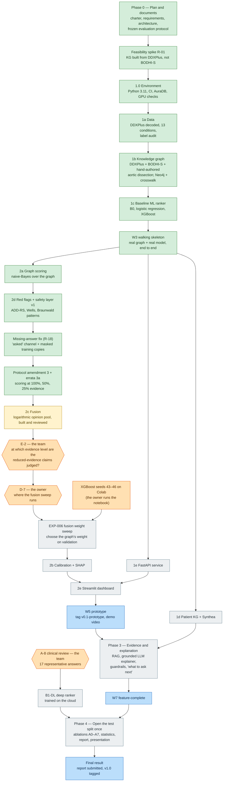
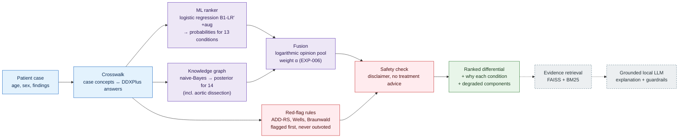
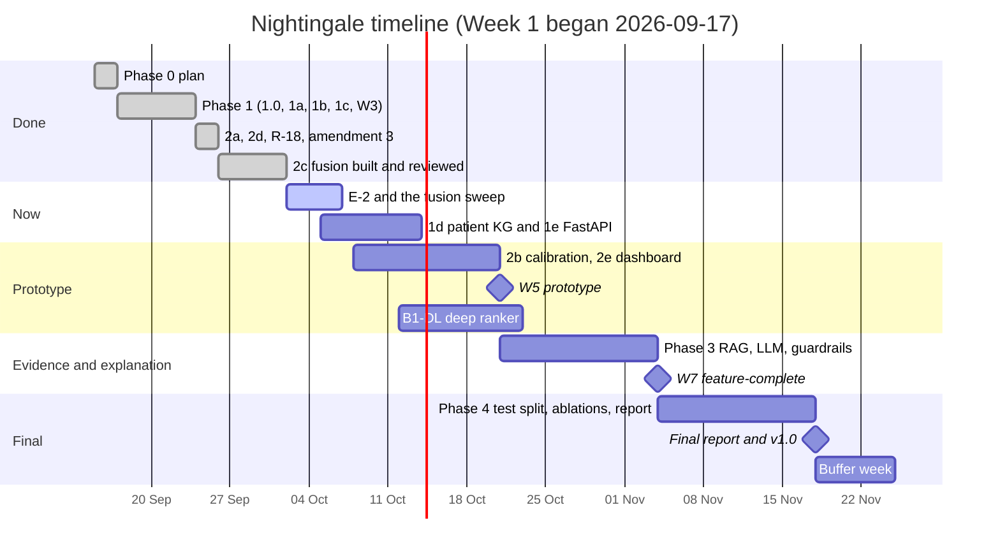

# 12 — Project Overview: what is done, how it works, and what is left

**As of:** 2026-10-02 (Week 3 of the 8–10 week plan; Week 1 began 2026-09-17) · **Last commit:**
`eb3b7d4` · **Source of truth:** `PROGRESS.md` (this file is a readable summary of it, not a
replacement)

Nightingale is a clinician-facing **decision-support prototype for acute chest pain**. Given a
patient's findings, it ranks 14 possible causes and explains the ranking. It is **decision
support only, never a diagnosis**. It combines four ideas:

1. an **ML ranker** that learned from 255,900 synthetic patients (DDXPlus);
2. a **medical knowledge graph** of conditions and their findings;
3. a **fusion** step that pools the two opinions into one ranking;
4. independent **red-flag rules** that can never be outvoted, for the conditions that kill if
   missed.

Phase 3 adds evidence retrieval and an explanation written by a local language model.

---

## 1. Where we are, in one picture

Green is done, yellow is in progress, orange waits for a decision by the team or the owner, and
grey is still to come.

**What the colours mean in practice:** everything up to the fusion is built, tested (734 tests,
CI green) and recorded in the experiment log. The fusion exists and is reviewed. Its one tuned
number, the graph's weight, is chosen by a pre-registered sweep, which waits for two answers: E-2
from the team, then the owner's choice of where it runs. The deep ranker separately waits for the
team's clinical review of 17 answers.

---

## 2. How the system works

If the model or the graph fails, the system **degrades and says so**: it ranks with what remains
and lists the missing part, instead of failing silently.

---

## 3. What has been done

| When | Step | What it produced | Key result |
|---|---|---|---|
| 2026-09-15–17 | **Scope and plan** (Phase 0) | 11 planning documents; the evaluation protocol frozen before any model existed | Chest pain only: 13 conditions from the data + aortic dissection |
| 2026-09-17 | **Feasibility spike** | `docs/10` | Only 31% of BODHI-S mapped (60% needed), so the graph is built from DDXPlus itself, which creates a **circularity risk (R-12)** that every result must disclose |
| 2026-09-18–19 | **Environment** (1.0) | Python 3.11, CI, Neo4j on AuraDB, laptop-GPU checks | Compute rules agreed: training on the cloud, laptop GPU for short tests only |
| 2026-09-18–20 | **Data** (1a) | Decoded DDXPlus: 33,963 validation and 255,900 training patients | Found that a listed answer can mean "no", and that the official differentials are open-world (fixed in amendment 1) |
| 2026-09-19 | **Knowledge graph** (1b) | 129 nodes, 321 edges from three sources, each edge with its source; a crosswalk between the two vocabularies | Aortic dissection, absent from the data, written in by hand from published markers |
| 2026-09-19–23 | **Baseline ML** (1c) | B0 (prevalence), logistic regression, XGBoost, trained on Colab | XGBoost ranks 99.85% of patients' true condition first, because of how DDXPlus was generated (**R-16**), not skill |
| 2026-09-23 | **Robustness finding** (EXP-017) | Models scored with part of the history hidden | At 25% of the history XGBoost collapses (top-1 0.27) and answers "atrial fibrillation" to short input; logistic regression holds (0.86) |
| 2026-09-24 | **Graph scoring** (2a) | Naive-Bayes score over the graph | Every golden test case ranks first on the graph alone |
| 2026-09-24 | 🎯 **W3 walking skeleton** | `scripts/demo.py`: real graph + real model, end to end | Milestone reached 13 days early |
| 2026-09-24–25 | **Missing-answer fix** (R-18, EXP-018) | An "asked" input channel and training on masked copies | The atrial-fibrillation failure is gone |
| 2026-09-25 | **Red flags + safety** (2d) | Rules after published clinical scores; a final safety check | Red-flag sensitivity 0.45 → 0.82 (target 0.95, capped by the data); false alarms on patients without a dangerous condition 31% → 25% |
| 2026-09-25 | **Amendment 3 + EXP-019** | Every system scored at 100%, 50% and 25% evidence | The original models miss the safety targets at 25%; the retrained ones meet them; the configured ranker became B1-LR′+aug |
| 2026-09-25–10-01 | **Fusion** (2c) | A logarithmic opinion pool; its weight sweep pre-registered | GC-003's aortic dissection now ranks first even with the red flags off |
| 2026-10-02 | **The team's decisions** | Amendment 3a (18 corrections); contracts change C-1; A-2, A-8, A-9 and T-6 settled | Checking it found that some reduced-evidence claims cannot be met as written, and that went back to the team (E-2) |

Every step above was checked by independent reviewers before it was committed. Each found real
errors, all corrected and recorded, including errors in claims made earlier in the project.

---

## 4. Techniques and principles, and the subjects they belong to

### 4.1 Medicine and clinical decision support

| Technique or principle | How it is used here | Subject |
|---|---|---|
| Differential diagnosis | The output is a ranked list of possible causes, not one answer | Clinical medicine (emergency medicine, cardiology) |
| "Must-not-miss" conditions | Eight conditions (MI, unstable angina, pulmonary embolism, aortic dissection, pneumothorax, Boerhaave, myocarditis, acute pulmonary edema) are tracked separately; the headline metric is whether they reach the top 3 | Emergency medicine, patient safety |
| Clinical prediction rules | Red flags follow the **ADD-RS** (aortic dissection), **Wells** (pulmonary embolism) and **Braunwald** (unstable angina) patterns | Evidence-based medicine |
| Decision support, not diagnosis | A disclaimer that cannot be removed; no treatment or drug advice | Medical ethics, health informatics |
| Alarm fatigue | Measured on patients without a dangerous condition, not on everyone | Clinical safety engineering |

### 4.2 Knowledge representation

| Technique or principle | How it is used here | Subject |
|---|---|---|
| Knowledge graph | Conditions linked to the findings they cause, stored in **Neo4j** (cloud) with **NetworkX** as fallback | Knowledge representation and reasoning; graph databases |
| Ontology mapping with SKOS match types | The crosswalk links hand-written concepts to DDXPlus answers as exact, close, broader or narrower matches, so only sound inferences are drawn | Semantic web, ontology engineering |
| Provenance | Every edge records its source (DDXPlus, BODHI-S, hand-authored) | Data provenance, research integrity |
| Closed-world assumption | The system knows 13 + 1 conditions; anything else is forced into one of them (**R-13**), and results say so | Knowledge representation, logic |

### 4.3 Probability and statistics

| Technique or principle | How it is used here | Subject |
|---|---|---|
| Naive Bayes | The graph's score: a log-likelihood of the findings under each condition | Bayesian statistics, probabilistic reasoning |
| Logarithmic opinion pool (product of experts) | Fuses the model's and the graph's probabilities, with one weight α and a 1% floor so a confident model cannot veto the graph | Decision theory, Bayesian statistics, ensemble methods |
| Calibration (ECE, Brier, reliability diagrams) | Whether a "70%" really means right 70% of the time; Platt or isotonic recalibration next | Statistics, probabilistic forecasting |
| Bootstrap confidence intervals | Every figure carries a 95% interval (1,000 resamples, seed 42) | Statistics (resampling) |
| McNemar's test; paired bootstrap | Paired comparison of two systems on the same patients (top-3 and MRR) | Statistics (hypothesis testing) |
| Intersection–union testing | A claim must pass every one of its comparisons, so no multiplicity correction is needed | Statistics (multiple testing) |

### 4.4 Machine learning

| Technique or principle | How it is used here | Subject |
|---|---|---|
| Supervised multi-class classification | Logistic regression and XGBoost (gradient-boosted trees) predict the condition | Machine learning |
| Feature engineering | 607–691 columns: binary, one-hot categorical, **ordinal** scales, and an explicit "asked" channel | Machine learning, data engineering |
| Missing-data handling and data augmentation | Training on masked copies teaches the model what an unasked question looks like | Machine learning (robustness) |
| Early stopping; no further tuning (T-6) | A fair comparison between models | Machine learning methodology |
| Label leakage prevention | The differential is the label and is never an input; "asked" is never read from default answers | Machine learning methodology |
| Deep ranker B1-DL (next) | A neural ranker compared with the classical ones at reduced evidence | Deep learning |
| SHAP (next) | Which findings drove each prediction | Explainable AI |

### 4.5 Information retrieval and language models (Phase 3)

| Technique or principle | How it will be used | Subject |
|---|---|---|
| Ranking metrics: top-k, MRR, Precision@3, Recall@5 | How good the ranked list is | Information retrieval |
| Hybrid retrieval: dense embeddings (FAISS) + BM25, then reranking | Finding supporting passages in PubMed/PMC | Information retrieval, NLP |
| Retrieval-augmented generation (RAG) | The explanation may only cite retrieved evidence | NLP, generative AI |
| Guardrails, claim-support checking | Every generated claim is checked against a source | AI safety, NLP |
| Local LLM (Ollama) | Explanations without sending patient data off the machine | Generative AI, privacy |

### 4.6 Research method

| Technique or principle | How it is used here | Subject |
|---|---|---|
| Pre-registration | Metrics, baselines and success criteria frozen before results (`docs/05`); changes only through a dated amendment log | Research methodology, open science |
| Train / validation / test discipline | Everything tuned on validation; the test split is opened **once**, in Phase 4 | Machine learning methodology |
| Baselines and ablations | B0–B4 baselines; ablations A0–A7 (and A1b) remove one component at a time | Experimental design |
| Robustness testing | Every system scored at 100%, 50% and 25% of each history, with masks fixed by recorded digests | Experimental design, reproducibility |
| Reproducibility | Fixed seeds (42–46), model fingerprints, saved masks' digests, results reproduced to 10⁻¹² | Research methodology |
| Disclosing threats to validity | Circularity (R-12), closed world (R-13), synthetic data, saturation (R-16) stated with every result | Research methodology |
| Independent adversarial review | Separate reviewers try to refute each result before it is committed | Scientific practice, quality assurance |

### 4.7 Software engineering

| Technique or principle | How it is used here | Subject |
|---|---|---|
| Typed interface contracts | `src/contracts.py` (Pydantic); changes need all four members | Software architecture |
| Stub-first walking skeleton | Every component had a trivial stub in Week 1, so the system ran end to end from the start | Software engineering (agile practice) |
| Graceful degradation | A failed component is reported, never silently dropped | Reliability engineering |
| Golden test cases | Four clinical cases that must always pass; if one fails, fix the component, never the expectation | Software testing (regression testing) |
| Continuous integration | 734 tests, formatter and linter on every push (GitHub Actions) | DevOps |
| Write-ahead progress log | `PROGRESS.md` is updated before and after every task, so an interrupted session can recover | Software engineering, borrowed from database write-ahead logging |
| Safe model storage | Models saved as JSON, never pickles | Software security |

---

## 5. What happens next, in order

| # | Step | Waits for | Rough effort |
|---|---|---|---|
| 1 | **E-2 item 1** — the team decides at which evidence level the reduced-evidence claims are judged (recommended: 25%) | the team | a reply |
| 2 | **EXP-006 sweep** — choose the fusion weight on validation | E-2, then the owner's D-7 choice (the laptop's CPU is suggested) | 3–5 min to run, ½ day to report |
| 3 | **XGBoost seeds 43–46** — the owner runs the Colab notebook; the laptop scores them | the owner | ~1 h on Colab, ½ day to score |
| 4 | **1e FastAPI service** and **1d patient KG + Synthea** | nothing | ~1 week together |
| 5 | **2b calibration + SHAP**, then **2e Streamlit dashboard** | the sweep | ~1 week |
| 6 | 🎯 **W5 prototype** — tag `v0.1-prototype`, record the demo video | 1–5 | — |
| 7 | **B1-DL deep ranker** — design, train on the cloud, score at three levels | the team's clinical review of A-8's 17 answers; a training location | ~1 week |
| 8 | **Phase 3** — evidence retrieval, the grounded LLM explainer (model choice D-5), guardrails, "what to ask next" | the prototype; GPU or cloud for the LLM | ~2 weeks |
| 9 | 🎯 **W7 feature-complete** | 8 | — |
| 10 | **Phase 4** — open the test split once; all ablations; statistics; report; presentation; compliance checklists; tag `v1.0` | everything above | ~2 weeks |

---

## 6. How much longer

**About 7 weeks of the 8–10-week plan remain.** The plan's dates still hold:

- the W5 prototype by **2026-10-21**;
- feature-complete by **2026-11-04**;
- the final report and `v1.0` by **2026-11-18**, about 6½ weeks from now;
- a buffer week to **2026-11-25**.

The project is **ahead of plan in some places**: the W3 skeleton came 13 days early, and 2a and
2d were pulled forward from Phase 2. It is **behind in two**: 1d (patient KG) and 1e (the FastAPI
service) have not started, and are now scheduled beside the Phase 2 work.

**What decides whether the dates hold** is mostly waiting, not building:

- **Team decisions and reviews.** E-2, the clinical review of A-8's 17 answers, and GC-005 each
  gate a step. A week's delay on any of them moves the deep ranker or the fusion results by about
  a week.
- **Cloud compute.** The deep ranker and any batch LLM runs need Colab or a university GPU (not
  yet granted, R-14).
- **The LLM choice** (D-5), deferred to Phase 3.

If the decisions come back within a few days of each request, the plan's dates are realistic. If
time runs short, the agreed cut line drops these first, in order:

1. the PTB-XL ECG and KG-embedding stretch goals;
2. "what to ask next";
3. hybrid retrieval;
4. the LLM explainer.

Three things are never cut: the W5 prototype, the red-flag layer and the ablation study.

---

## 7. Honest limits to keep in mind

- **Synthetic data.** DDXPlus patients are generated, not real; every accuracy claim says so.
- **Saturation (R-16).** On full DDXPlus histories the baseline is nearly perfect, so the fusion
  cannot beat it there. That is why the protocol also scores 50% and 25% histories. E-2 shows the
  retrained baselines saturate at 50% too.
- **Circularity (R-12).** The graph is built from the same source the model learns from. The
  graph's 92% top-1 on DDXPlus is therefore not evidence of skill; the hand-written golden cases
  are.
- **Closed world (R-13).** A condition outside the 14 is always forced into one of them.
- **Not a diagnosis.** Nightingale is a prototype for decision support, with a disclaimer on every
  result and no treatment advice.
