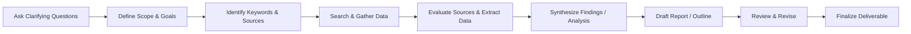
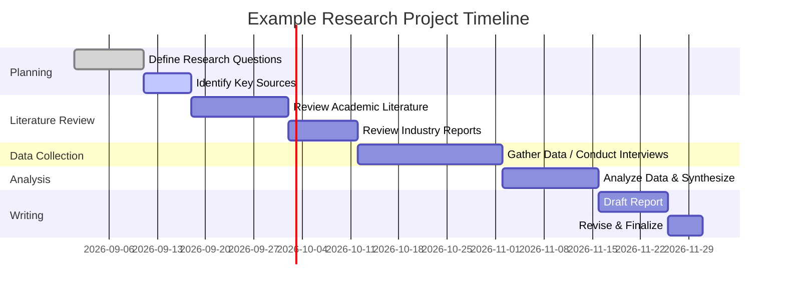

# Guide to Conducting a Research Task

**Executive Summary:** This report provides a step-by-step framework for tackling an open-ended research assignment. It begins by listing *clarifying questions* to ask the stakeholder (to define scope, goals, constraints, etc.). It then outlines a generic *research plan template* with phases (scope, search, data extraction, synthesis, deliverables). We discuss *timelines* and effort estimates for small, medium, and large projects. A reusable *checklist* is provided, along with a comparison table of common research outputs (literature review, market analysis, technical report, policy brief) detailing their typical length, structure, audience, and sources. Recommended *tools and databases* (academic, news, patents, data) are listed, with tips on verifying credibility and avoiding bias. We suggest when to use visualizations (flowcharts, Gantt charts, summary tables) and include Mermaid diagrams illustrating a sample research workflow and timeline. Finally, two sample research briefs (academic and market) demonstrate how to apply this template. This actionable guide emphasizes clarity at each step and is designed for any research topic.

## 1. Clarifying Questions (to Define the Task)

Before diving into research, ask the requester to clarify the assignment. Key questions include:
- **What exactly needs to be delivered?** (e.g. research report, briefing memo, slide deck). Understanding the *deliverable* helps set scope and format. 
- **What is the core research question or objective?** (What problem or decision is this research supporting?)
- **Why is this important?** (What is the context or background? What will the findings be used for?)
- **Who is the audience or stakeholder?** (e.g. executives, technical team, public, policymakers) – tailor depth and jargon accordingly.
- **What is the timeline or deadline?** (Is the timeline fixed or flexible?)
- **What resources or constraints exist?** (Budget, available data, languages, proprietary limitations, etc.)
- **What is *in scope* and *out of scope*?** (Explicitly confirm topics to include and exclude to avoid wasted effort.)
- **What criteria define success?** (How will you know the research is useful?)
- **Are there key terms, concepts, or prior work to focus on?** (Any suggested keywords or seminal sources?)
- **Who else is involved?** (Identify stakeholders or experts to consult or cite.)
- **How will the research be used?** (Inform a policy, support a proposal, educate an audience, etc.)
  
Prioritizing these questions avoids misunderstandings. For example, confirming the **deliverable and deadline upfront** sets a clear target (as Planview notes, knowing the expected output and timeline is the first step in defining scope).  Clearly defining *what success looks like* helps shape the research effort and avoid unnecessary work.

## 2. Research Plan Template (Step-by-Step)

A structured research plan keeps the project on track. Below is a generic template adaptable to any topic:

1. **Define Scope and Objectives:** Restate the research question(s) and goals in your own words. Clarify the *purpose* and *scope* of the study (e.g. time frame, geography, facets). Determine specific sub-questions to answer and any hypotheses if needed.  
2. **Identify Audience and Stakeholders:** Note who will read the results and what they expect. Tailor tone (technical vs. general) and depth to that audience.
3. **Outline Search Strategy:** Develop keywords and Boolean queries for searching. Use synonyms and related terms. Plan which *sources to search* first (academic databases, news archives, industry reports, patents, etc.). 
4. **Select Source Databases:** Prioritize *reliable, authoritative sources*: e.g. academic (Google Scholar, JSTOR, PubMed, IEEE Xplore) for research papers; news databases (LexisNexis, Factiva) for media coverage; patent databases (Google Patents, USPTO, Espacenet) for technical innovations; open data portals (Data.gov, WHO, Kaggle) for statistics; industry/government reports.  
5. **Inclusion/Exclusion Criteria:** Define clear filters for selecting sources. For example, include peer-reviewed or official reports; exclude outdated or non-credible sites. Specify date range, languages, geographic focus, etc., to keep scope tight.  
6. **Data Extraction Fields:** Create a table or spreadsheet to record key details from each source: citation, authors, date, context, methodology, findings/results, limitations, and notes. This ensures consistency when synthesizing later.  
7. **Collect and Review Sources:** Systematically search each database and gather relevant documents. Keep track of search queries and results. For each source, evaluate credibility: prefer peer-reviewed journals or official data, check author expertise and potential bias. Use the CRAAP criteria (Currency, Relevance, Authority, Accuracy, Purpose) to judge quality.  
8. **Synthesize Findings:** Group the extracted data by themes or research questions. Identify patterns, agreements, conflicts, and gaps. Summarize the evidence in your own words, noting how each piece informs the questions. A matrix or annotated bibliography can help organize comparisons.  
9. **Structure the Deliverable:** Outline the report based on its type. Common sections include Introduction (context, objectives), Methodology (how research was done), Findings/Discussion (synthesized results), Conclusions/Recommendations, and References. Adapt structure to format (e.g. policy briefs use titled sections like “Background,” “Options,” “Recommendations”).  
10. **Draft and Review:** Write the report, integrating citations properly. Begin with a clear thesis or answer, then back it with evidence. After drafting, review for clarity, accuracy, and completeness. Check that all claims are supported by your collected sources.  
11. **Finalize and Deliver:** Ensure all data and quotes are cited. Create any tables, charts or visuals. Format according to requirements (word count, style guide, etc.). Deliver the output in the agreed format. 

Above all, **document your process** as you go (e.g. keep notes on search strategy and decisions) to maintain transparency and reproducibility. As Nielsen Norman Group advises for UX research plans, be sure to cover the *purpose/goals, participants (if any), methods/procedure, and any relevant documents* (in this case, references). 

> **Example of Workflow (flowchart):** To visualize these steps, see the flowchart below. Each block represents a phase of research from clarification to delivery. Mermaid diagrams like this can help team members understand the process at a glance.

## 3. Timelines and Effort Estimates

The time required depends on scope and depth. As a rough guide:
- **Small task (days–2 weeks):** Well-defined, narrow topic (e.g. quick literature scan or data query). Expect to do a concise report or slide deck. Tasks often include one research question, a limited number of sources, and minimal data analysis. (E.g. undergraduate term project in a few weeks).  
- **Medium task (1–3 months):** Broader scope with multiple phases. For instance, a market analysis for a mid-sized market or a short policy study. Likely phases: a couple of weeks for literature review, several weeks for data collection/analysis, and a few weeks for writing. In [22], a sample project allocates *about 8 weeks to data collection and ~6 weeks to writing*. A medium project might require parallel workstreams or a small team.  
- **Large task (6+ months):** Comprehensive multi-phase projects (e.g. a major industry report, graduate thesis, or multi-part investigation). These include detailed planning, extensive data gathering (surveys, experiments, large datasets), iterative analysis, and multiple review rounds. For example, by weeks 3–4 the research questions should be solidified, but full projects often span several quarters or more. Room for unexpected delays should be built in. 

 *Figure: Example Research Timeline (Gantt chart).* A realistic timeline breaks the project into phases (planning, research, analysis, writing) with milestones. Using a Gantt chart helps visualize each task’s duration and order.

Building buffer time is crucial. As LucenSoftware notes, a good timeline is a *living document* that anticipates delays (e.g. needing extra time for harder tasks). Adjust estimates if phases run short or long, and communicate any changes to stakeholders promptly.

## 4. Checklist and Research Output Comparison

**Reusable Checklist:** Before finalizing your work, ensure you have: 
- ✔ **Confirmed research question and objectives.**  
- ✔ **Documented scope and constraints.**  
- ✔ **Compiled a list of keywords and databases to search.**  
- ✔ **Extracted relevant data into a table.**  
- ✔ **Noted inclusion/exclusion criteria and applied them.**  
- ✔ **Evaluated each source’s credibility (peer-review, author, publisher).**  
- ✔ **Cited all sources properly.**  
- ✔ **Organized findings by themes.**  
- ✔ **Drafted the report according to the audience and format.**  
- ✔ **Included visuals (charts, tables) where helpful.**  
- ✔ **Proofread for clarity, bias, and completeness.**  
- ✔ **Met the length and style guidelines for the deliverable.**  

Use this checklist at each major milestone (after planning, after searching, and before submission).

**Output Comparison:** Different research outputs have distinct conventions. The table below compares four common types:  

| **Output Type**       | **Typical Length**                      | **Typical Structure**                                                | **Audience**                       | **Source Types**                                               |
|-----------------------|-----------------------------------------|-----------------------------------------------------------------------|------------------------------------|---------------------------------------------------------------|
| **Literature Review** | Course assignment: *~500–1,000 words* Journal article: *5,000+ words* | Introduction (context), thematic synthesis of sources, conclusion (gaps) | Scholars or students (academic)    | Peer-reviewed journals, books, conference proceedings |
| **Market Analysis**   | *20–60 pages* depending on scope | *Exec. Summary*; Methodology (market definition, data sources); Findings (market size, trends, competitors); Recommendations; Appendix (data tables) | Business managers, investors      | Industry reports, financial filings, surveys, news, market data |
| **Technical Report**  | *10–30 pages* (varies widely)           | Abstract/Executive Summary; Introduction (scope, objectives); Methods/Procedures; Results (data); Discussion; Conclusion/Recommendations; References; Appendices | Technical stakeholders (engineers, developers) | Experimental data, technical specifications, standards, academic papers |
| **Policy Brief**      | *2–5 pages* (concise)                  | Title; Executive Summary (1–2 para); Context/Problem; Policy Options; Recommendations; (optional Appendices); References | Policymakers, program managers   | Research studies, statistics, government reports, expert testimony |

This table is illustrative: adjust lengths and sections as required. For example, literature reviews in a thesis can be chapters (10+ pages), while policy briefs are kept very short and visual. The key is meeting the audience’s needs with appropriate detail and evidence. 

## 5. Tools, Databases, and Verifying Credibility

**Academic & Technical Sources:** Search engines and databases like **Google Scholar**, **JSTOR**, **PubMed**, **arXiv**, **IEEE Xplore**, and university library catalogs provide access to peer-reviewed journal articles, theses, and conference papers. Use reference managers (Zotero, Mendeley) to organize citations. Preprint servers (e.g. SSRN, bioRxiv) can have cutting-edge research; always check if later published.  

**News & Media:** For press coverage or industry news, use aggregated databases such as **LexisNexis (Nexis Uni)** or **Factiva**. LexisNexis alone offers *“over 4 billion searchable documents from 36,000 global business and legal sources, including newspapers, newswires, transcripts...”*. Google News or specialized feeds (e.g. RSS from key outlets) are free alternatives. Check newspaper archives for historical context.  

**Patents & Innovation:** **Google Patents**, **USPTO**, and **EPO Espacenet** allow free search of global patents (useful for technical research). For scientific data and code, look on **GitHub**, **Zenodo**, or discipline-specific repositories.  

**Statistical & Survey Data:**  Open data portals like **Data.gov** (US), **EU Open Data**, **World Bank Data**, **OECD**, or **WHO Global Health Observatory** provide government-collected statistics. Domain-specific sources (e.g. UN Comtrade for trade data, FAO for agriculture) may be needed. **Kaggle** and Google Dataset Search index many open datasets. Always note data provenance and update frequency.  

**Other Tools:** Academic social networks (ResearchGate, Academia.edu) can reveal papers and data but treat with caution (they host user-uploaded content). Patent analytics, financial databases, GIS tools, and specialized software (e.g. SPSS, NVivo) may be relevant for analysis.  

**Checking Credibility and Bias:** Always assess sources critically. As Harvard advises, *“the most reliable sources are those vetted by scholars”* – i.e. peer-reviewed journals or academic books. Verify author credentials and affiliations. Check the publication date and whether content has been updated or retracted. Beware of conflicts of interest (industry-funded studies, advocacy groups). Cross-check facts using multiple sources. Watch out for bias: consider who is publishing (a trade group, government, independent research) and their agenda. Tools like the CRAAP test (evaluating Currency, Relevance, Authority, Accuracy, Purpose) are helpful. For web content, prefer sites that clearly cite data (e.g. .gov, .edu, reputable news). When in doubt, seek corroboration elsewhere or consult a librarian/research specialist.

## 6. Recommended Visualizations

Using diagrams and charts can greatly enhance understanding. For example:

- **Flowcharts or Process Diagrams:** Map out research workflows, decision trees, or conceptual relationships. Mermaid flowcharts (as above) or tools like Draw.io can illustrate steps clearly. This helps team members see the plan at a glance.  
- **Gantt Charts / Timelines:** Visualize project schedules with a Gantt chart (as shown above) or timeline to track phases and deadlines. This makes overlaps and dependencies visible.  
- **Tables and Matrices:** As we used above, comparison tables (e.g. between output types) or a source-extraction matrix can condense information.  
- **Charts and Graphs:** In deliverables like reports or briefs, use bar charts, line graphs, or pie charts to highlight trends or comparisons. For example, a policy brief often *“includes graphs, charts, or other visual aids to make information easier to digest”*. Choose the chart type that suits your data (e.g. a bar chart for categorical comparisons, line chart for trends over time).  
- **Mermaid Gantt / Flow Diagrams:** For Markdown or documentation, embed Mermaid diagrams as we have. They are easy to update and version control-friendly.  

*When to include visuals:*  
- Show a timeline with a Gantt when you need to clarify a schedule to stakeholders.  
- Use a flowchart when outlining methods or logic (e.g., how sources lead to conclusions).  
- Include charts in final reports to present key quantitative findings (with clear labels and citations).  
- Always caption and reference figures/tables in text. 

Using the right visualization at the right stage makes the research process and results more transparent and compelling.

## 7. Example Research Briefs

Below are two illustrative briefs that apply the above template. They are not real projects but show the expected format and content for an academic-style and a market research brief.

### Example A: Academic Research Brief

**Title:** *The Impact of Remote Work on Employee Productivity*

**Background:** The COVID-19 pandemic has shifted many firms to remote work. Organizations are interested in understanding how this change affects productivity and what factors (e.g. flexible hours, home environment, management practices) influence outcomes.

**Objective & Scope:** Investigate whether remote work increases or decreases employee productivity, and identify mediating factors. Focus on knowledge-sector employees in North America (studies since 2020). Exclude industries where remote work is impossible (e.g. manufacturing).

**Research Questions:** (1) How has average productivity changed under remote work? (2) What factors (time management, tech tools, work–life balance) correlate with these changes? (3) What practices mitigate any productivity loss?

**Methods:** Perform a **systematic literature review** of peer-reviewed studies and industry reports on remote work productivity. Keywords will include “remote work productivity,” “telecommuting outcomes,” “hybrid work models,” etc. Databases: Google Scholar, JSTOR, IEEE Xplore, and business databases. Inclusion: studies with empirical productivity measures (surveys, output metrics). Exclusion: articles without clear methodology or prior to 2015. 

**Data Extraction:** For each source, extract author/year, country context, sample size, productivity measure, key findings (positive/negative impact, factors noted). 

**Analysis & Synthesis:** Compare findings across studies, noting patterns (e.g. most find slight productivity gains but increased burnout; technology use is a positive factor). Identify consensus and gaps (e.g. lack of long-term longitudinal data).

**Deliverable:** A 15-page report with charts summarizing average productivity changes and key factors. Structure: Abstract, Intro, Methods, Results (with tables/graphs), Discussion, Conclusion. Include an annotated bibliography of major sources.

**Timeline:** 2 weeks for literature search; 1 week extracting data; 1 week writing draft; 3–4 days review and finalize. 

**Example Visualization:** The report will include a bar chart comparing productivity scores from several studies, and a conceptual flow diagram showing how factors (like workspace quality or communication tools) mediate productivity changes.

### Example B: Market Research Brief

**Title:** *Market Analysis of Electric Vehicle (EV) Charging Stations in Europe*

**Background:** Europe’s transition to electric vehicles has spurred demand for charging infrastructure. An EV charging station operator wants a market analysis to inform investment in new locations.

**Objective & Scope:** Estimate the market size and growth drivers for public EV charging stations in the EU (focus on passenger vehicles, years 2021–2026). Scope includes number of existing stations, usage trends, key players, regulatory incentives. Excludes commercial trucking or non-EU markets.

**Research Questions:** (1) What is the current and projected number of EV charging stations in Europe? (2) Which countries and segments (fast chargers vs. standard) are driving growth? (3) Who are the major competitors and what are their market shares? (4) What policies or incentives affect the market?

**Methods:** Aggregate data from industry reports and news. Key sources: European Automobile Manufacturers Association (ACEA) statistics, market reports (IEA, BloombergNEF), government energy reports, and press releases. Search Google, Factiva, and company databases. Conduct **competitive analysis** by reviewing top providers (e.g. Tesla, Ionity, local utilities). 

**Data Extraction:** Collect figures on number of chargers by country, year, and charger type. Note growth rates and quotations from experts. Compile a list of competitors with brief company profiles and their number of stations.

**Deliverable:** A slide-deck-style PDF (~20 slides) plus an executive summary (2 pages). Sections: Market Overview, Methodology, Findings (with graphs on growth trends and market share pie chart), Conclusions, Appendix. 

**Key Insights (sample):**  
- EU had ~250,000 public EV chargers in 2022 and is projected to exceed 400,000 by 2026 (25% CAGR).  
- Growth concentrated in Germany, Netherlands, and France. Fast-charging infrastructure is doubling every 2 years.  
- Top competitors (Tesla Supercharger, Ionity) hold ~30% combined market share in fast charging.  
- Subsidies (e.g. EU Recovery funds) significantly affect regional expansion plans.

**Timeline:** 1 week to gather reports and data, 3 days to analyze and make charts, 4 days to draft slides, 2 days for review. 

**Recommended Visuals:** Charts showing charger count by year (line chart), market share (donut chart), and a map of key country opportunities. 

---

*Sources:* Information in this guide is based on best practices for research planning and writing, as documented in academic and professional sources. These include university writing guides and industry articles on research methodology and report design. Always adapt this template to your specific assignment and industry context.